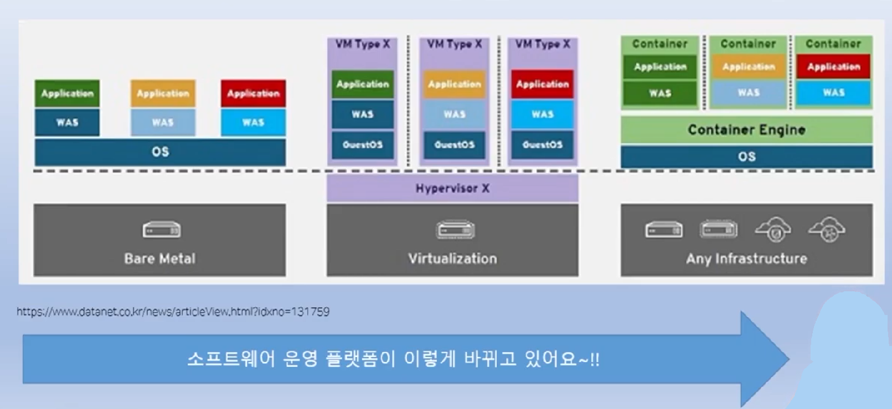
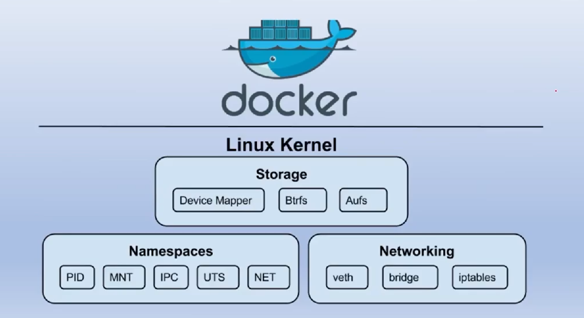
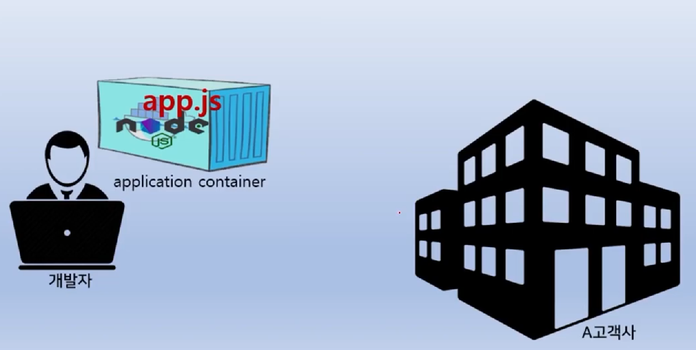
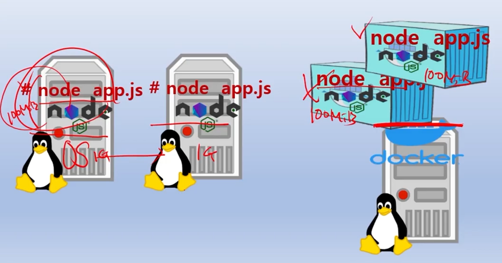

# Docker
- 이성미 강사님의 [따라하며 배우는 도커 유튜브 강의](https://www.youtube.com/watch?v=NLUugLQ8unM&list=PLApuRlvrZKogb78kKq1wRvrjg1VMwYrvi)를 정리한 내용임

## 컨테이너란?
### 컨테이너를 배워야 하는 이유?
- 대규모의 시스템들을 효율적으로 운영 가능 
- 용어 정리
  - Bare Metal: OS를 포함한 소프트웨어가 전혀 설치 되지 않은 H/W 시스템
- 세대별 변환
  - 1세대: Bare Metal 시스템에 하나의 OS와 여러개의 어플리케이션을 설치
  - 2세대: Hypervisor 기술 위에 Virtual Machine을 여러 개 설치해서 머신마다 어플리케이션을 설치
  - 3세대: 하나의 OS위에 컨테이너 엔진을 올리고, Application이 설치된 여러 개의 Container들을 동작시킴
    - Scale Out을 하기 쉬움
    - Virtual Machine에 비해 가볍고, 성능이 좋음  


### 컨테이너란 개념
- Application과 그것을 동작시키는데 필요한 라이브러리 또는 소프트웨어 플랫폼들을 구성한 독립된 공간
### 리눅스에서 동작시켜야 하는 이유
- 리눅스 커널 기능을 사용해야 하기 때문
  - chroot: 독립된 공간 형성
  - namespace: 독립된 공간안에 6가지 종류의 isolate 기능을 지원
    - 하나의 가상 시스템인 것처럼 동작 시킴    
  - cgroup: 필요한 만큼의 HW 지원


- 윈도우나 Mac OS에서 동작시키는 방법
  - Hypervisor를 활성화 시킴
### 일반 프로그램과 컨테이너의 차이
- 하는 일은 동일하나, 구조가 다름
- 아래와 같이 Node.js 기반의 서버 프로그램이 있다고 가정
```bash
$cat app.js
const http = require('http');
const os = require('os');
console.log("Test server starting.....");
var handler = function(req, res) {
    res.writeHead(200);
    res.end("Container Hostname: " + os.hostname() + "\n");
};
var www = http.createServer(handler);
www.listen(8080);
```
- 일반 프로그램으로 동작 시키려면?
  - OS가 설치된 물리적인 서버에 Node.js를 설치
  - 프로그래밍(``app.js``)을 작성
  - ``node app.js``라는 명령 수행
- 컨테이너로 동작 시키려면?
  - 프로그래밍(``app.js``)을 작성
  - Docker 이미지 생성을 위한 Dockerfile 작성해서 컨테이터 빌드
    - ``node.js``가 깔린 이미지로 부터 ``app.js``를 복사
    - 실행시 동작해야 하는 Entry Point 지정    
```bash
$cat Dockerfile
FROM node:12
COPY app.js /app.js
ENTRYPOINT ["node", "app.js"]
```
- 컨테이너는 8080 포트를 열고, 서비스를 제공해 줌
### 컨테이너를 사용하는 이유?
- 개발자가 만든 설정 그대로 어디서든 돌아감 
- 개발 환경과 운영 환경이 달라도 문제가 없음 (H/W, Base Platform)
  - 개발자의 application container 내부에 해당 application을 동작시키는 소프트웨어가 모두 존재
  - 개발자가 만든 application이 운영환경에서도 똑같이 동작함


- 확장/축소(ScaleOut/ScaleIn)가 쉽고, MSA 및 DevOps에 적합
  - Virtual Machine의 기반에서는 확장 시, OS의 개수가 계속 늘어나는 문제가 존재

