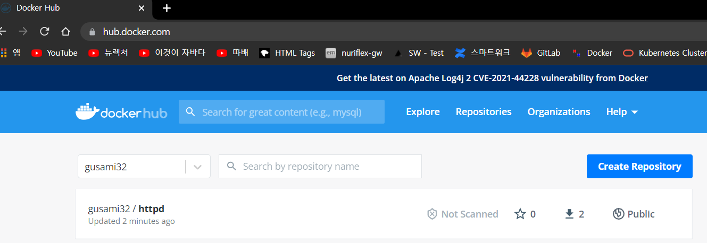
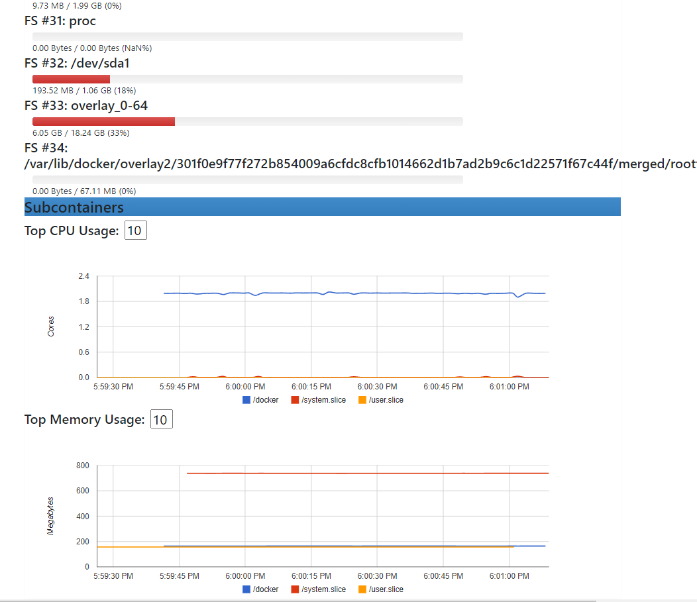

# Docker
- 이성미 강사님의 [따라하며 배우는 도커 유튜브 강의](https://www.youtube.com/watch?v=NLUugLQ8unM&list=PLApuRlvrZKogb78kKq1wRvrjg1VMwYrvi)를 정리한 내용임

## 컨테이너란?
### 컨테이너를 배워야 하는 이유?
- 대규모의 시스템들을 효율적으로 운영 가능 
- 용어 정리
  - Bare Metal: OS를 포함한 소프트웨어가 전혀 설치 되지 않은 H/W 시스템
- 세대별 변환
  - 1세대: Bare Metal 시스템에 하나의 OS와 여러개의 어플리케이션을 설치
  - 2세대: Hypervisor 기술 위에 Virtual Machine을 여러 개 설치해서 머신마다 어플리케이션을 설치
  - 3세대: 하나의 OS위에 컨테이너 엔진을 올리고, Application이 설치된 여러 개의 Container들을 동작시킴
    - Scale Out을 하기 쉬움
    - Virtual Machine에 비해 가볍고, 성능이 좋음  


### 컨테이너란 개념
- Application과 그것을 동작시키는데 필요한 라이브러리 또는 소프트웨어 플랫폼들을 구성한 독립된 공간
### 리눅스에서 동작시켜야 하는 이유
- 리눅스 커널 기능을 사용해야 하기 때문
  - chroot: 독립된 공간 형성
  - namespace: 독립된 공간안에 6가지 종류의 isolate 기능을 지원
    - 하나의 가상 시스템인 것처럼 동작 시킴    
  - cgroup: 필요한 만큼의 HW 지원


- 윈도우나 Mac OS에서 동작시키는 방법
  - Hypervisor를 활성화 시킴
### 일반 프로그램과 컨테이너의 차이
- 하는 일은 동일하나, 구조가 다름
- 아래와 같이 Node.js 기반의 서버 프로그램이 있다고 가정
```bash
$cat app.js
const http = require('http');
const os = require('os');
console.log("Test server starting.....");
var handler = function(req, res) {
    res.writeHead(200);
    res.end("Container Hostname: " + os.hostname() + "\n");
};
var www = http.createServer(handler);
www.listen(8080);
```
- 일반 프로그램으로 동작 시키려면?
  - OS가 설치된 물리적인 서버에 Node.js를 설치
  - 프로그래밍(``app.js``)을 작성
  - ``node app.js``라는 명령 수행
- 컨테이너로 동작 시키려면?
  - 프로그래밍(``app.js``)을 작성
  - Docker 이미지 생성을 위한 Dockerfile 작성해서 컨테이터 빌드
    - ``node.js``가 깔린 이미지로 부터 ``app.js``를 복사
    - 실행시 동작해야 하는 Entry Point 지정    
```bash
$cat Dockerfile
FROM node:12
COPY app.js /app.js
ENTRYPOINT ["node", "app.js"]
```
- 컨테이너는 8080 포트를 열고, 서비스를 제공해 줌
### 컨테이너를 사용하는 이유?
- 개발자가 만든 설정 그대로 어디서든 돌아감 
- 개발 환경과 운영 환경이 달라도 문제가 없음 (H/W, Base Platform)
  - 개발자의 application container 내부에 해당 application을 동작시키는 소프트웨어가 모두 존재
  - 개발자가 만든 application이 운영환경에서도 똑같이 동작함


- 확장/축소(ScaleOut/ScaleIn)가 쉽고, MSA 및 DevOps에 적합
  - Virtual Machine의 기반에서는 확장 시, OS의 개수가 계속 늘어나는 문제가 존재


## 도커 설치하기
### 설치 준비 사항
- 컴퓨터: BareMetal 또는 VirtualMachine
  - cpu: 2 Core, memory: 2GB 이상 
- 운영체제: 리눅스 또는 Windows 등  
- Docker 프로그램
- Docker 서비스 실행
### 도커 설치
- 옵션이 여러개
  - 옵션 1: VirtualBox 설치(HyperVisor 프로그램)-네트워크 구성-가상 머신(VM) 만들기
    - 옵션 1-1: VM에 ``Ubuntu 20.04`` 설치하고 기본 환경 구성하기
    - 옵션 1-2: VM에 ``centOS`` 설치하고 기본 환경 구성하기
    - Ubuntu/CentOS Server에 Docker 설치하기 (실제 사이트에서는 Ubuntu와 CentOS의 비율이 비슷)
  - 옵션 2: Windows 10에 DockerDesktop 설치

### VirtualBox 설치, Network 구성 그리고, 가상머신 만들기
- Step 01: VirtualBox(Hypervisor의 일종) 다운로드 후 설치
  - https://www.virtualbox.org
- Step 02: Virbual Box의 Network 구성
  - NAT 네트워크 추가: 파일-환경설정-네트워크-추가
  - 네트워크 이름: localNetwork
  - 네트워크 CIDR: 10.100.0.0/24
  - DHCP 지원
  - 포트 포워딩
```bash
이름     프로토콜  호스트IP    호스트포트   게스트IP       게스트포트
docker1  TCP      127.0.0.1   105         10.100.0.105   22
docker1  TCP      127.0.0.1   106         10.100.0.106   22
```
- Step 03: 두 대의 가상머신 만들기
  - 이름: docker-ubuntu
    - CPU(2core), Memory(2GB), network(localNetwork), disk(20GB)
  - 이름: docker-centos
    - CPU(2core), Memory(2GB), network(localNetwork), disk(20GB)
  - **실제 OS Install이 되는 것은 아니고, OS 설치를 위한 가상머신이 생성 완료**
- Step 03-1: docker-ubuntu 설정
  - VirtualBox 왼쪽 메뉴의 도구 > 새로 만들기
    - 이름: docker-ubuntu
    - 머신 폴더: D:\VirtualBox VMs
    - 종류: Linux
    - 버전: Unbuntu (64-bit)
  - 메모리(4GB)와 Disk(20GB)를 제외하고 기본 설정으로 설치
  - 설치 완료 후, ``docker-ubuntu`` 선택 후, 설정 버튼 클릭
    - 시스템 > 프로세서: CPU 개수를 2개로 조정
    - 시스템 > 마더보드: 부팅 순서에 플로피 해제
    - 네트워크 > 어댑터 1
      - 다음에 연결됨: ``NAT``를 ``NAT 네트워크``로 변경      
      - 이름: ``docker-network`` 선택
- Step 03-2: docker-centos 설정
  - VirtualBox 왼쪽 메뉴의 도구 > 새로 만들기
    - 이름: docker-ubuntu
    - 머신 폴더: D:\VirtualBox VMs
    - 종류: Linux
    - 버전: Red Hat (64-bit)
  - 메모리(2GB)와 Disk(20GB)를 제외하고 기본 설정으로 설치
  - 설치 완료 후, ``docker-centos`` 선택 후, 설정 버튼 클릭
    - 시스템 > 프로세서: CPU 개수를 2개로 조정
    - 시스템 > 마더보드: 부팅 순서에 플로피 해제
    - 네트워크 > 어댑터 1
      - 다음에 연결됨: ``NAT``를 ``NAT 네트워크``로 변경      
      - 이름: ``docker-network`` 선택

### VM에 Ubuntu 20.04 설치하고 기본 환경 구성하기
#### Ubuntu 20.04 다운로드 및 설치
- 다운로드: https://ubuntu.com/download/desktop
  - Desktop version을 다운로드: Server Version은 GUI가 없음
  - 20.04.XX LTS(Long Term Support-10년)을 다운로드
- VirtualBox에서 해당 Virtual Machine를 선택
  - 저장소 > 광학드라이브 > 디스크 파일 선택 > Ubuntu 파일 선택
  - 시작 버튼을 누르면 설치가 시작됨
- 설치 순서
  - 언어 선택(한국어) > Ubuntu 설치 > 키보드 선택 > 일반 설치 > 새로 만든 디스크 지우고 설치
  - 지금 설치 > 포맷 > 계속 설치 > 타임존 설정 > 관리자 계정 생성:gusami/******
  - 당신은 누구십니까?
    - 이름: gusami
    - 컴퓨터 이름: docker-ubuntu.example.com
    - 사용자 이름: gusami
  - 설치 진행(약 20분 소요)
- 설치 완료되면 리부팅 진행
#### 설치 후 환경 구성
- GUI로그인: gusami/******
- 화면 우측 상단에 네트워크 마크를 클릭하면 설정으로 이동
  - 디스플레이 > 해상도를 1280 * 960으로 조정
- 서버 구성: 네트워크 설정 > IPv4 > 수동
  - 주소: 10.100.0.105, Netmaks: 24, 게이트웨이: 10.100.0.1 네임서버: 10.100.0.1
    - 터미널에서 ``ip addr`` 명령어를 이용해서 바뀐 주소 확인
  - hostname 변경
    - ``$vi /etc/hostname``에서 ``docker-Ubuntu.example.com``로 수정
  - /etc/hosts 파일에 호스트 정보 추가
```bash
$sudo vi /etc/hosts
127.0.0.1      localhost
10.100.0.105   docker-ubuntu.example.com    docker-ubuntu
10.100.0.106   docker-centos.example.com    docker-centos

# The following lines are desirable for IPv6 capable hosts
....
# Google DNS(8.8.8.8)를 PING 테스트를 진행해 봄
$ping -c 3 8.8.8.8
```  
- Text 부팅으로 수정: GUI 환경의 부팅은 리소스를 많이 먹고, 속도도 늦음
  - ``$systemctl set-default multi-user.target``
  - 만약, GUI 부팅으로 되돌리고 싶으면, ``$systemctl isolate graphical.target`` 수행
- root password 설정: 기본적으로 암호가 설정되어 있지 않아서 root 계정을 사용 못함
  - ``$sudo passwd root``
  - ``$su - root``: root 계정으로 전환
- SSH 서버 설치 후 운영
  - ``$apt-get update``
  - ``$apt-get install -y openssh-server curl vim tree``
  - 설치 후, ssh daemon 상태 체크
    - ``$systemctl status sshd``
  - Xshell로 로그인 구성
    - VirtualBox에서 설정된 포트 포워딩 규칙을 이용해서 ``localhost``의 105번 포트에 대한 연결을 XShell에 생성
  - 현재 OS 정보 확인: ``$cat /etc/os-relase``
  - 현재 시스템의 메모리 사용량 확인: ``$free -h``
  - 현재 OS의 커널 정보 학인: ``$uname -r``
- 현재까지 구성된 가상머신의 OS 상태를 저장하고 싶다면?
  - VirtualBox에서 해당 가상머신의 오른쪽의 햄버거 마크를 클릭
    - 스냅샷 > 현재 정보를 기록 > 찍기

### VM에 CentOS 7 설치하고 기본 환경 구성하기
#### CentOS 7 (Redhat 기반)다운로드 및 설치
- 다운로드: https://centos.org
- 설치 후 환경구성
  - 관리자 계정: gusami/e****3
  - root password: e*****3
  - 해상도 조절
  - 네트워크 구성: 10.100.0.106/24, GW: 10.100.0.1, DNS: 10.100.0.1
    - hostname: docker-centos.example.com
    - /etc/hosts 구성
  - text-login 구성
  - sshd 서비스 동작상태 확인
  - Xshell로 로그인 가능 여부 확인
- VirtualBox에서 해당 Virtual Machine를 선택
  - 설정 > 시스템 > 마더보드 > 기본 메모리를 4096MB로 설정
  - 설정 > 저장소 > 컨트롤러 IDE > 광학드라이브 > 디스크 파일 선택 > 다운받은 이미지 선택 > 확인
  - 시작 버튼을 누르면 설치가 시작됨
  - ``Install CentOS 7`` 선택 후 > Enter 키
- 설치 순서
  - 언어 선택(English-United States)
  - Date & Time Zone > Seoul 선택
  - Software Selection > GNOME Desktop : 만약, ``Minimal Install``을 선택하면, GUI가 뜨지 않음
  - Installtion Destination > Automatic Partitioning Selected 상태
  - Network & Host Name > Ethernet On: DHCP를 이용해서 IP가 자동 할당됨
    - Host name 변경: docker-centos.example.com
    - Configure > IPv4 Settings > Method를 Manual로 선택: 네트워크를 Static IP로 변경
      - Add: Address: 10.100.0.106, Netmask: 24, Gateway: 10.100.0.1
      - DNS servers: 10.100.0.1
      - Done 선택
  - ``Begin Installation`` 선택
    - 설치 중에 ``Root Password``를 선택해서 암호 설정: ``e******3``
    - 설치 중에 ``User Creation``를 선택해서 사용자 계정 생성 및 암호 설정: ``gusami/e******3``    
  - 설치 진행(약 20분 소요)
  - 설치 완료 후, ``Reboot`` 버튼 클릭 
  - Licensing > 클릭 후, ``I accept the license agreement``선택
    - ``Finish Configuration`` 선택
  - 로그인 화면 > ``gusami`` 아래의 ``not listed``를 선택하면, ``root``로 로그인 가능
    - ``root``로 로그인
    - CentOS는 root가 시스템관리자 계정으로 등록되어 있음
      - ubuntu는 gusami가 시스템 관리자 계정임
#### 기본 환경 구성 및 VM 네트워크 설정
- 화면 상단 왼쪽에 메뉴가 두 개 위치
  - Applications
  - Places
- 화면 상단 오른쪽에 위치한 전원버튼을 마우스 클릭  > 설정 버튼 클릭
  - Devices 선택 > Resolution > 1280 * 960 선택 > Apply
  - Region & Language > input source 아래에 위치한 ``+`` 버튼을 클릭 > Korean > Korean(hangul) 선택
    - 한글 입력 가능하게 됨
  - Privacy > Automatic Screen Lock > Off
  - Power > Blank screen > Never
  - Network > 설정 버튼 클릭
    - IP, Gateway, DNS 확인
    - Connect automatically > Checked    
- 화면 상단 왼쪽 ``Applications`` > ``System Tools`` > ``Terminal`` 선택
  - centOS는 가상 머신안에 또다른 Hypervisor가 존재: 삭제 처리해야 함. ``virbr0`` 항목
```bash
# CentOS
$ip addr
$systemctl stop libvirtd
$systemctl disable libvirtd
```

- 네트워크 파일 확인
  - ``/etc/hostname`` 파일 확인
  - ``/etc/hosts`` 파일에 docker-ubuntu와 docker-centos 등록
```bash
$cat /etc/hostname
docker-centos.example.com
# hosts 파일에 docker-ubuntu와 docker-centos 등록
$vi /etc/hosts
.....
10.100.0.105  docker-ubuntu.example.com
10.100.0.106  docker-centos.example.com
# Google DNS(8.8.8.8)를 PING 테스트를 진행해 봄
$ping 8.8.8.8 -c 3
# text login
```
- Text 부팅으로 수정: GUI 환경의 부팅은 리소스를 많이 먹고, 속도도 늦음
  - ``$systemctl set-default multi-user.target``
  - 만약, GUI 부팅으로 되돌리고 싶으면, ``$systemctl isolate graphical.target`` 수행
- 기본적으로 SSHD(SSH Demon) 가 동작
```bash
$systemctl status sshd
```
- 기본적으로 ``curl`` 설치가 되어 있음
- ``tree``이 설치되어 있지 않음
```bash
$yum install -y tree
```
- 화면 상단 오른쪽에 power button을 눌러 Power off
- Xshell로 로그인 구성
    - VirtualBox에서 설정된 포트 포워딩 규칙을 이용해서 ``localhost``의 106번 포트에 대한 연결을 XShell에 생성
  - 현재 계정 정보 확인: ``$whoami``  
  - 현재 주소 확인: ``$ip addr``  
  - hostname 확인: ``$hostname``
  - 현재 OS 정보 확인: ``$cat /etc/os-relase``
  - 현재 시스템의 메모리 사용량 확인: ``$free -h``
  - 현재 OS의 커널 정보 학인: ``$uname -r``
- 현재까지 구성된 가상머신의 OS 상태를 저장하고 싶다면?
  - VirtualBox에서 해당 가상머신의 오른쪽의 햄버거 마크를 클릭
    - 스냅샷 > 현재 정보를 기록 > 찍기
### Ubuntu/CentOS Server에 Docker 설치하기
- CentOS와 Ubuntu에 Docker 설치: https://docs.docker.com
- 설치 방법
  - Repository를 이용해서 설치
  - Download 후 직접 설치
  - Script를 이용한 설치
- 설치 후, 동작 상태 확인
- 계정 추가
#### Ubuntu Sever에 Docker 설치하기
- Install Docker Engine on Ubuntu: https://docs.docker.com/engine/install/ubuntu/
- XShell 로그인
- 기존의 설치된 docker old 버전이 있다면 삭제하기
```bash
 $sudo apt-get remove docker docker-engine docker.io containerd runc
 ```
- 설치방법 01: Repository를 이용해서 설치 (우리가 사용)
  - docker를 install할 시스템이 외부 네트워크에 접근이 가능한 경우


- 설치방법 02: Download 후 직접 설치
  - docker 프로그램을 다른 시스템에서 다운로드 받은 후, 복사해서 직접 설치
- 설치방법 03: Script를 이용한 설치
  - ``설치 방법 01``과 ``설치 방법 02``를 할 수 있도록 스크립트를 제공
##### Repository를 이용한 설치
- docker package repository의 URL을 설치하고자 하는 로컬시스템에 등록해줘야 함 
- Step 01: HTTP를 통해 docker package repository를 사용하기 위한 패키지 설치
```bash
$sudo apt-get update
$sudo apt-get install \
    ca-certificates \
    curl \
    gnupg \
    lsb-release
```    
- Step 02: 인증서를 로컬에 저장
  - docker package들은 인증서를 가지고 디지털 서명이 되어 있음
```bash
$curl -fsSL https://download.docker.com/linux/ubuntu/gpg | sudo gpg --dearmor -o /usr/share/keyrings/docker-archive-keyring.gpg
```  
- Step 03: 다운받은 인증서를 이용해서 URL 등록
```bash
$echo \
  "deb [arch=$(dpkg --print-architecture) signed-by=/usr/share/keyrings/docker-archive-keyring.gpg] https://download.docker.com/linux/ubuntu \
  $(lsb_release -cs) stable" | sudo tee /etc/apt/sources.list.d/docker.list > /dev/null
```  
- Step 04: install with ``apt-get command``
  - 새로 등록된 URL을 이용하여 package index를 업데이트: ``sudo apt-get update``
```bash
$sudo apt-get update
# docker-ce: docker daemon
# docker-ce-cli: client command
# containerd.io: docker engine
$sudo apt-get install docker-ce docker-ce-cli containerd.io -y
 ```
- Step 05: 설치가 잘 되었는지 확인
```bash
# 방법1: hello-world image을 다운로드 한 후, 실행
$sudo docker run hello-world
# 방법2: docker version으로 확인하는 방법. client와 server의 모든 정보가 나와야 함
$sudo $ sudo docker version
Client: Docker Engine - Community
 Version:           20.10.11
 API version:       1.41
 Go version:        go1.16.9
 Git commit:        dea9396
 Built:             Thu Nov 18 00:37:06 2021
 OS/Arch:           linux/amd64
 Context:           default
 Experimental:      true

Server: Docker Engine - Community
 Engine:
  Version:          20.10.11
  API version:      1.41 (minimum version 1.12)
  Go version:       go1.16.9
  Git commit:       847da18
  Built:            Thu Nov 18 00:35:15 2021
  OS/Arch:          linux/amd64
  Experimental:     false
 containerd:
  Version:          1.4.12
  GitCommit:        7b11cfaabd73bb80907dd23182b9347b4245eb5d
 runc:
  Version:          1.0.2
  GitCommit:        v1.0.2-0-g52b36a2
 docker-init:
  Version:          0.19.0
  GitCommit:        de40ad0
```
#### CentOS Sever에 Docker 설치하기
- Install Docker Engine on CentOS: https://docs.docker.com/engine/install/centos/
  - CentOS 7 or 8에서 설치 가능
- XShell 로그인
- 기존의 설치된 docker old 버전이 있다면 삭제하기
```bash
 $sudo yum remove docker \
                  docker-client \
                  docker-client-latest \
                  docker-common \
                  docker-latest \
                  docker-latest-logrotate \
                  docker-logrotate \
                  docker-engine
 ```
- 설치방법 01: Repository를 이용해서 설치 (우리가 사용)
  - docker를 install할 시스템이 외부 네트워크에 접근이 가능한 경우
- 설치방법 02: RPM package Download 후 직접 설치
  - docker 프로그램을 다른 시스템에서 다운로드 받은 후, 복사해서 직접 설치
- 설치방법 03: Script를 이용한 설치
  - ``설치 방법 01``과 ``설치 방법 02``를 할 수 있도록 스크립트를 제공
##### Repository를 이용한 설치
- docker package repository의 URL을 설치하고자 하는 로컬시스템에 등록해줘야 함 
- CentOS는 **root 계정**으로 설치해줘야 함
- Step 01: HTTP를 통해 docker package repository를 사용하기 위한 패키지 설치   
```bash
$yum install -y yum-utils
```    
- Step 02: Repository URL을 로컬에 등록
```bash
$yum-config-manager \
>     --add-repo \
>     https://download.docker.com/linux/centos/docker-ce.repo
Loaded plugins: fastestmirror, langpacks
adding repo from: https://download.docker.com/linux/centos/docker-ce.repo
grabbing file https://download.docker.com/linux/centos/docker-ce.repo to /etc/yum.repos.d/docker-ce.repo
repo saved to /etc/yum.repos.d/docker-ce.repo
```  
- Step 03: install with ``yum install command``
  - 설치 시, 인증서를 가져옴 (Ubuntu와 차이점)
```bash
# docker-ce: docker daemon
# docker-ce-cli: client command
# containerd.io: docker engine
$yum install docker-ce docker-ce-cli containerd.io -y
 ```
- Step 04: docker service daemon 시작 및 활성화(Ubuntu와 차이점)
```bash
$systemctl start docker
$systemctl enable docker
Created symlink from /etc/systemd/system/multi-user.target.wants/docker.service to /usr/lib/systemd/system/docker.service.
# service enable 상태 확인: 다음 부팅시에도 서비스가 동작.(centOS에만 필요)
$systemctl status docker
● docker.service - Docker Application Container Engine
     Loaded: loaded (/lib/systemd/system/docker.service; enabled; vendor preset: enabled)
     Active: active (running) since Sat 2021-12-11 11:32:12 KST; 41min ago
TriggeredBy: ● docker.socket
       Docs: https://docs.docker.com
   Main PID: 7457 (dockerd)
      Tasks: 9
     Memory: 30.6M
     CGroup: /system.slice/docker.service
             └─7457 /usr/bin/dockerd -H fd:// --containerd=/run/containerd/containerd.sock
```
- Step 05: 설치가 잘 되었는지 확인
```bash
# docker version으로 확인하는 방법. client와 server의 모든 정보가 나와야 함
$docker version
Client: Docker Engine - Community
 Version:           20.10.11
 API version:       1.41
 Go version:        go1.16.9
 Git commit:        dea9396
 Built:             Thu Nov 18 00:38:53 2021
 OS/Arch:           linux/amd64
 Context:           default
 Experimental:      true

Server: Docker Engine - Community
 Engine:
  Version:          20.10.11
  API version:      1.41 (minimum version 1.12)
  Go version:       go1.16.9
  Git commit:       847da18
  Built:            Thu Nov 18 00:37:17 2021
  OS/Arch:          linux/amd64
  Experimental:     false
 containerd:
  Version:          1.4.12
  GitCommit:        7b11cfaabd73bb80907dd23182b9347b4245eb5d
 runc:
  Version:          1.0.2
  GitCommit:        v1.0.2-0-g52b36a2
 docker-init:
  Version:          0.19.0
  GitCommit:        de40ad0
```
### 계정에 Docker 관리자 권한주기 on Ubuntu and CentOS
- 설치 후, root계정만이 ``docker`` 명령어를 수행 가능
- ``root``로 로그인 후, ``docker`` 그룹에 사용자를 추가하면 됨
```bash
gusami@docker-ubuntu:~$su -
암호: 
root@docker-ubuntu:~#usermod -a -G docker gusami
root@docker-ubuntu:~#su - gusami
gusami@docker-ubuntu:~$docker ps
CONTAINER ID   IMAGE     COMMAND   CREATED   STATUS    PORTS     NAMES
```
```bash
[gusami@docker-centos ~]$su -
Password: 
Last login: Sat Dec 11 11:52:41 KST 2021 on pts/0
[root@docker-centos ~]#usermod -a -G docker gusami
[root@docker-centos ~]#su - gusami
Last login: Sat Dec 11 10:55:28 KST 2021 from 10.100.0.2 on pts/0
[gusami@docker-centos ~]$docker ps
CONTAINER ID   IMAGE     COMMAND   CREATED   STATUS    PORTS     NAMES
```
### Windows에 DockerDesktop 설치하기
- hub.docker.com 계정 등록 (gusami32/e******3)
  - docker container image가 등록된 Hub 사이트
- DockerDesktop 설치하기
  - Hyper-V 가상화 기능 활성화
  - WSL2(Windows Subsystem for Linux v.2)의 리눅스 커널 설치
    - DockerDesktop 설치 시, 자동 설치  
- Docker 동작 상태 확인
#### 다운로드 및 설치
- 설치 방법: https://docs.docker.com/desktop/windows/install/
- Download Docker Desktop for windows
- ``Docker Desktop Installer.exe`` 더블 클릭해서 실행
- 선행 조건
  - Enable Hyper-V Windows Features (bios에서 hyper-v로 설정되어 있어야 함)
  - hub.docker.com 계정으로 로그인 할 수 있어야 사용 가능 
- 명령어를 이용해서 Hyper-v 기능 on
  - open a cmd with admin privilige
  - turn on
    - bcdedit /set hypervisorlaunchtype auto
  - turn off
    - bcdedit /set hypervisorlaunchtype off
  - reboot
- 설치 후, Hyper-V와 WSL2 기능 활성화를 위해 윈도우 리부팅이 필요
- 만약에 필요하다는 메시지가 뜨면, WSL2 업데이트와 리눅스를 설치하는 방법
  - https://docs.microsoft.com/en-us/windows/wsl/install-manual 참조 
- 정상 설치 후, 윈도우 오른쪽 하단의 docker system tray가 생김
- PowerShell을 관리자 버전으로 실행
  - ``docker version``을 통해 버전 확인
```bash
PS C:\Windows\system32> docker version
Client:
 Cloud integration: v1.0.22
 Version:           20.10.11
 API version:       1.41
 Go version:        go1.16.10
 Git commit:        dea9396
 Built:             Thu Nov 18 00:42:51 2021
 OS/Arch:           windows/amd64
 Context:           default
 Experimental:      true

Server: Docker Engine - Community
 Engine:
  Version:          20.10.11
  API version:      1.41 (minimum version 1.12)
  Go version:       go1.16.9
  Git commit:       847da18
  Built:            Thu Nov 18 00:35:39 2021
  OS/Arch:          linux/amd64
  Experimental:     false
 containerd:
  Version:          1.4.12
  GitCommit:        7b11cfaabd73bb80907dd23182b9347b4245eb5d
 runc:
  Version:          1.0.2
  GitCommit:        v1.0.2-0-g52b36a2
 docker-init:
  Version:          0.19.0
  GitCommit:        de40ad0
```
- docker login후 사용 가능
```bash
PS C:\Windows\system32> docker login
Login with your Docker ID to push and pull images from Docker Hub. If you don't have a Docker ID, head over to https://hub.docker.com to create one.
Username: gusami32
Password:
Login Succeeded

Logging in with your password grants your terminal complete access to your account.
For better security, log in with a limited-privilege personal access token. Learn more at https://docs.docker.com/go/access-tokens/
```
- docker image download
```bash
PS C:\Windows\system32> docker pull nginx
Using default tag: latest
latest: Pulling from library/nginx
e5ae68f74026: Pull complete
21e0df283cd6: Pull complete
ed835de16acd: Pull complete
881ff011f1c9: Pull complete
77700c52c969: Pull complete
44be98c0fab6: Pull complete
Digest: sha256:9522864dd661dcadfd9958f9e0de192a1fdda2c162a35668ab6ac42b465f0603
Status: Downloaded newer image for nginx:latest
docker.io/library/nginx:latest
```
- docker 이미지 실행
```bash
PS C:\Windows\system32> docker run -d -p 80:80 --name web nginx
67f84a250b844ad7abd0b795c53de1312667424ec42dcf32c94b35f4acbe3d03
```
- nginx 접속
```bash
PS C:\Windows\system32> curl http://localhost:80


StatusCode        : 200
StatusDescription : OK
Content           : <!DOCTYPE html>
                    <html>
                    <head>
                    <title>Welcome to nginx!</title>
                    <style>
                    html { color-scheme: light dark; }
                    body { width: 35em; margin: 0 auto;
                    font-family: Tahoma, Verdana, Arial, sans-serif; }
                    </style...
RawContent        : HTTP/1.1 200 OK
                    Connection: keep-alive
                    Accept-Ranges: bytes
                    Content-Length: 615
                    Content-Type: text/html
                    Date: Sat, 11 Dec 2021 04:46:47 GMT
                    ETag: "61814ff2-267"
                    Last-Modified: Tue, 02 Nov 2021 ...
Forms             : {}
Headers           : {[Connection, keep-alive], [Accept-Ranges, bytes], [Content-Length, 615], [Content-Type, text/html]
                    ...}
Images            : {}
InputFields       : {}
Links             : {@{innerHTML=nginx.org; innerText=nginx.org; outerHTML=<A href="http://nginx.org/">nginx.org</A>; o
                    uterText=nginx.org; tagName=A; href=http://nginx.org/}, @{innerHTML=nginx.com; innerText=nginx.com;
                     outerHTML=<A href="http://nginx.com/">nginx.com</A>; outerText=nginx.com; tagName=A; href=http://n
                    ginx.com/}}
ParsedHtml        : mshtml.HTMLDocumentClass
RawContentLength  : 615
```
- docker container 중지
```bash
PS C:\Windows\system32> docker rm -f web
web
```
- docker image 삭제
```bash
PS C:\Windows\system32> docker rmi nginx
Untagged: nginx:latest
Untagged: nginx@sha256:9522864dd661dcadfd9958f9e0de192a1fdda2c162a35668ab6ac42b465f0603
Deleted: sha256:f652ca386ed135a4cbe356333e08ef0816f81b2ac8d0619af01e2b256837ed3e
Deleted: sha256:a7edf84b6db27e8ef5d7368c95159120f00a74cee57368e2bc107ee713172699
Deleted: sha256:46893639b5fbc6315531cb197fb4071750508880425c0620d88aae4e483d72c1
Deleted: sha256:afa1ff13852cf0fa5d5ff8cd21c8a21a99c139fc069926cd1316d1ad3d0c7189
Deleted: sha256:831e8983bb6a65130bec4e73bed4bc641bfd6d7c6917be32a483882f70e809b0
Deleted: sha256:d213f9a0e4eef08107f70d94b36f5a41c1437fc68af82ee82eb74de80282130a
Deleted: sha256:9321ff862abbe8e1532076e5fdc932371eff562334ac86984a836d77dfb717f5
```
- docker image 목록 확인
```bash
PS C:\Windows\system32> docker images
REPOSITORY   TAG       IMAGE ID   CREATED   SIZE
```
- docker desktop 실행 종료
  - system tray에서 마우스 우클릭 후, 종료 버튼을 누름
- docker desktop 서비스 중지
  - 윈도우 서비스에서 수동으로 전환 후, 정지 시킴

## 컨테이너와 컨테이너 이미지
### 컨테이너
- 컨테이너는 하나의 Application 프로세스
- 컨테이너는 완전히 독립된 공간에 분리되어서 운영됨
  - 별도의 CPU, Memory, Host name과 Network, Disk
  - User Id
- 컨테이너 이미지가 메모리에 로딩되어 실행되는 상태


- docker host
  - docker가 설치되어 docker daemon(dockerd)이 실행되는 리눅스 커널 시스템
### 컨테이너 이미지
- 컨테이너 이미지는 하드 디스크에 파일로 존재
- 만약, node js 기반에 app.js를 코딩해서 실행하고 싶다면?
  - 컨테이너 이미지는 여러 Layer로 구성됨
    - base image Layer
    - appjs source image Layer
    - ``run node app.js`` Layer
  
  
### 컨테이너 동작 방식
- Docker Host와 Docker Hub가 존재
- Docker Hub: Docker Container Image가 저장된 Repository
- 사용예: Docker Hub에서 nginx container image를 찾아라!!
```bash
$docker search nginx
```
- 사용예: Docker Hub에서 nginx container image를 최신본을 가져와라!!  
```bash
$docker pull nginx:latest
```
- 사용예: 다운받은 Docker nginx container image를 실행해서 컨테이너 생성해라!!
  - ``run, create, start`` 명령어  
```bash
$docker run -d --name web -p80:80 nginx:latest
```
### 용어 정리
- Docker Host (Linux Kernel)
- Docker Daemon: systemctl start docker
- Docker Client Command: docker
- Docker Hub
- Container Images
- Container


### 실습
- docker daemon이 동작 중인지 확인
```bash
gusami@docker-ubuntu:~$sudo systemctl status docker
[sudo] gusami의 암호: 
● docker.service - Docker Application Container Engine
     Loaded: loaded (/lib/systemd/system/docker.service; enabled; vendor preset: enabled)
     Active: active (running) since Wed 2021-12-15 22:29:23 KST; 3min 33s ago
TriggeredBy: ● docker.socket
       Docs: https://docs.docker.com
   Main PID: 677 (dockerd)
      Tasks: 8
     Memory: 105.3M
     CGroup: /system.slice/docker.service
             └─677 /usr/bin/dockerd -H fd:// --containerd=/run/containerd/containerd.sock

12월 15 22:29:22 docker-ubuntu.example.com dockerd[677]: time="2021-12-15T22:29:22.980384435+09:00" level=warning msg="Your kernel does not sup>
12월 15 22:29:22 docker-ubuntu.example.com dockerd[677]: time="2021-12-15T22:29:22.980425913+09:00" level=warning msg="Your kernel does not sup>
12월 15 22:29:22 docker-ubuntu.example.com dockerd[677]: time="2021-12-15T22:29:22.980431473+09:00" level=warning msg="Your kernel does not sup>
12월 15 22:29:22 docker-ubuntu.example.com dockerd[677]: time="2021-12-15T22:29:22.981084107+09:00" level=info msg="Loading containers: start."
12월 15 22:29:23 docker-ubuntu.example.com dockerd[677]: time="2021-12-15T22:29:23.215296025+09:00" level=info msg="Default bridge (docker0) is>
12월 15 22:29:23 docker-ubuntu.example.com dockerd[677]: time="2021-12-15T22:29:23.250771249+09:00" level=info msg="Loading containers: done."
lines 1-17...skipping...
● docker.service - Docker Application Container Engine
     Loaded: loaded (/lib/systemd/system/docker.service; enabled; vendor preset: enabled)
     Active: active (running) since Wed 2021-12-15 22:29:23 KST; 3min 33s ago
TriggeredBy: ● docker.socket
       Docs: https://docs.docker.com
   Main PID: 677 (dockerd)
      Tasks: 8
     Memory: 105.3M
     CGroup: /system.slice/docker.service
             └─677 /usr/bin/dockerd -H fd:// --containerd=/run/containerd/containerd.sock

12월 15 22:29:22 docker-ubuntu.example.com dockerd[677]: time="2021-12-15T22:29:22.980384435+09:00" level=warning msg="Your kernel does not sup>
12월 15 22:29:22 docker-ubuntu.example.com dockerd[677]: time="2021-12-15T22:29:22.980425913+09:00" level=warning msg="Your kernel does not sup>
12월 15 22:29:22 docker-ubuntu.example.com dockerd[677]: time="2021-12-15T22:29:22.980431473+09:00" level=warning msg="Your kernel does not sup>
12월 15 22:29:22 docker-ubuntu.example.com dockerd[677]: time="2021-12-15T22:29:22.981084107+09:00" level=info msg="Loading containers: start."
12월 15 22:29:23 docker-ubuntu.example.com dockerd[677]: time="2021-12-15T22:29:23.215296025+09:00" level=info msg="Default bridge (docker0) is>
12월 15 22:29:23 docker-ubuntu.example.com dockerd[677]: time="2021-12-15T22:29:23.250771249+09:00" level=info msg="Loading containers: done."
12월 15 22:29:23 docker-ubuntu.example.com dockerd[677]: time="2021-12-15T22:29:23.314708665+09:00" level=info msg="Docker daemon" commit=847da>
12월 15 22:29:23 docker-ubuntu.example.com dockerd[677]: time="2021-12-15T22:29:23.315513164+09:00" level=info msg="Daemon has completed initia>
12월 15 22:29:23 docker-ubuntu.example.com systemd[1]: Started Docker Application Container Engine.
12월 15 22:29:23 docker-ubuntu.example.com dockerd[677]: time="2021-12-15T22:29:23.338471841+09:00" level=info msg="API listen on /run/docker.s>
```
- docker hub에서 nginx container 찾기
```bash
gusami@docker-ubuntu:~$docker search nginx
NAME                              DESCRIPTION                                     STARS     OFFICIAL   AUTOMATED
nginx                             Official build of Nginx.                        15972     [OK]       
jwilder/nginx-proxy               Automated Nginx reverse proxy for docker con…   2103                 [OK]
richarvey/nginx-php-fpm           Container running Nginx + PHP-FPM capable of…   820                  [OK]
jc21/nginx-proxy-manager          Docker container for managing Nginx proxy ho…   293                  
linuxserver/nginx                 An Nginx container, brought to you by LinuxS…   161                  
tiangolo/nginx-rtmp               Docker image with Nginx using the nginx-rtmp…   148                  [OK]
jlesage/nginx-proxy-manager       Docker container for Nginx Proxy Manager        147                  [OK]
alfg/nginx-rtmp                   NGINX, nginx-rtmp-module and FFmpeg from sou…   112                  [OK]
nginxdemos/hello                  NGINX webserver that serves a simple page co…   79                   [OK]
privatebin/nginx-fpm-alpine       PrivateBin running on an Nginx, php-fpm & Al…   61                   [OK]
nginx/nginx-ingress               NGINX and  NGINX Plus Ingress Controllers fo…   59                   
nginxinc/nginx-unprivileged       Unprivileged NGINX Dockerfiles                  56                   
nginxproxy/nginx-proxy            Automated Nginx reverse proxy for docker con…   31                   
staticfloat/nginx-certbot         Opinionated setup for automatic TLS certs lo…   25                   [OK]
nginx/nginx-prometheus-exporter   NGINX Prometheus Exporter for NGINX and NGIN…   22                   
schmunk42/nginx-redirect          A very simple container to redirect HTTP tra…   19                   [OK]
centos/nginx-112-centos7          Platform for running nginx 1.12 or building …   16                   
centos/nginx-18-centos7           Platform for running nginx 1.8 or building n…   13                   
flashspys/nginx-static            Super Lightweight Nginx Image                   11                   [OK]
bitwarden/nginx                   The Bitwarden nginx web server acting as a r…   11                   
mailu/nginx                       Mailu nginx frontend                            10                   [OK]
webdevops/nginx                   Nginx container                                 9                    [OK]
sophos/nginx-vts-exporter         Simple server that scrapes Nginx vts stats a…   7                    [OK]
ansibleplaybookbundle/nginx-apb   An APB to deploy NGINX                          3                    [OK]
wodby/nginx                       Generic nginx                                   1                    [OK]
```
- 다운로드된 docker image 확인
```bash
root@docker-ubuntu:/var/lib/docker/overlay2$docker images ls
REPOSITORY   TAG       IMAGE ID   CREATED   SIZE
```
- docker hub에서 nginx container image 다운로드
  - ``Pull complete`` 라인의 개수가 Layer 개수를 의미
  - Layer는 ``/var/lib/docker/overlay2`` 디렉토리의 파일로 존재
```bash
root@docker-ubuntu:/var/lib/docker/overlay2$docker pull nginx
Using default tag: latest
latest: Pulling from library/nginx
e5ae68f74026: Pull complete 
21e0df283cd6: Pull complete 
ed835de16acd: Pull complete 
881ff011f1c9: Pull complete 
77700c52c969: Pull complete 
44be98c0fab6: Pull complete 
Digest: sha256:9522864dd661dcadfd9958f9e0de192a1fdda2c162a35668ab6ac42b465f0603
Status: Downloaded newer image for nginx:latest
docker.io/library/nginx:latest
```
```bash
root@docker-ubuntu:/var/lib/docker/overlay2$ls -l
drwx--x--- 4 root root 4096 12월 16 22:10 4576390776f4daafd0e07a5b3a88bee2df4ec195e3598e6376df28d87c060d41
drwx--x--- 4 root root 4096 12월 16 22:10 6d4b7d6f9be0010639e125d174f623fd9f5972aacf8f8fe8af1bacde6648d4d9
drwx--x--- 4 root root 4096 12월 16 22:10 6e95d5578380d1d3b2291d1b00c3d17a6407d78a04488a276421ce0b00c415f9
drwx--x--- 3 root root 4096 12월 16 22:10 7da02fd3d3ba3d663cea7eb47a2efe23e0a62f902cc1e9586dde6f410c955ef2
drwx--x--- 4 root root 4096 12월 16 22:10 895a8b414b39370cf72fd748998cd1d11a55b08b95aa69d82e692787debd5202
drwx--x--- 4 root root 4096 12월 16 22:10 ce1c2b29c3602d08cc0b56f1805aeb22659b64d45ce58c703d2c781541451376
```
```bash
gusami@docker-ubuntu:~$docker image ls
REPOSITORY    TAG       IMAGE ID       CREATED        SIZE
nginx         latest    f652ca386ed1   2 weeks ago    141MB
```
- 컨테이너 실행하고 확인해 보기
  - ``docker run`` 명령어를 사용
```bash
# 실행시 컨테이너 ID를 결과로 보여줌
gusami@docker-ubuntu:~$ docker run --name web -d -p 80:80 nginx
6eb251c65633b8262f63ebd05d4bb63afc2f8a94a84835086b30cbe44253a801
```
- 현재 실행중인 도커 컨테이너 프로세스 보기
```bash
gusami@docker-ubuntu:~$docker ps
CONTAINER ID   IMAGE     COMMAND                  CREATED              STATUS              PORTS                               NAMES
6eb251c65633   nginx     "/docker-entrypoint.…"   About a minute ago   Up About a minute   0.0.0.0:80->80/tcp, :::80->80/tcp   web
```
- nginx에 접속해 보기
```bash
gusami@docker-ubuntu:~$ curl localhost:80
<!DOCTYPE html>
<html>
<head>
<title>Welcome to nginx!</title>
<style>
html { color-scheme: light dark; }
body { width: 35em; margin: 0 auto;
font-family: Tahoma, Verdana, Arial, sans-serif; }
</style>
</head>
<body>
<h1>Welcome to nginx!</h1>
<p>If you see this page, the nginx web server is successfully installed and
working. Further configuration is required.</p>

<p>For online documentation and support please refer to
<a href="http://nginx.org/">nginx.org</a>.<br/>
Commercial support is available at
<a href="http://nginx.com/">nginx.com</a>.</p>

<p><em>Thank you for using nginx.</em></p>
</body>
</html>
```
- docker container 중지하기
```bash
gusami@docker-ubuntu:~$docker stop web
web
gusami@docker-ubuntu:~$docker ps
CONTAINER ID   IMAGE     COMMAND   CREATED   STATUS    PORTS     NAMES
```
- docker container 지우기
  - docker container 이미지는 로컬에 그대로 존재
```bash
gusami@docker-ubuntu:~$docker rm web 
web
gusami@docker-ubuntu:~$docker ps -a
CONTAINER ID   IMAGE     COMMAND   CREATED   STATUS    PORTS     NAMES
```
- docker container image 지우기
```bash
# image 지우기
gusami@docker-ubuntu:~$docker rm image nginx
# 디렉토리에서 확인
root@docker-ubuntu:/var/lib/docker/overlay2# ls -l
```
## 컨테이너 만들어 보기 (이론)
### 무엇을 컨테이너로 만드는 거죠?
- **개발한 애플리케이션(실행파일)과 운영환경이 모두 들어있는 독립된 공간**
  - Layer 1: 운영 환경(예: nodejs, python, tensorflow)
  - Layer 2: 소스 코드 또는 컴파일된 바이너리 파일(예: hello.js 파일)
  - Layer 3: 소스 코드 또는 바이너리를 실행할 명령어(예: 명령어 ``node hello.js``)


- 개발한 프로그램과 실행환경을 모두 컨테이너로 생성
- MSA(Micro Service Architecture) 환경의 다양한 언어(Polyglot)의 애플리케이션 운영
  - Polyglot Programming: 다양한 언어를 사용하여 프로그래밍 하는 것!


### 컨테이너를 만드는 방법(Dockerfile)
- Dockerfile을 이용해 컨테이너를 빌드한다
- Dockerfile은?  
  - 쉽고 간단하고 명확한 구문을 가진 text file로 Top-down 해석
    - Dockerfile의 윗줄부터 아랫줄로 차례대로 해석해서 적용
  - 컨테이너 이미지를 생성할 수 있는 **고유의 지시어**(Instruction)를 가짐
  - 대소문자를 구분하지 않으나 가독성을 위해 지시어는 대문자를 사용
    - ``FROM, COPY, CMD``
```bash
$mkdir build
$cd build
$vi dockerfile
FROM node:12
COPY hello.js /
CMD ["node", "/hello.js"]
$docker build -t imagename:tag
```
#### Dockerfile 문법 (핵심 지시어만 정리)
- ``#``: comment
- ``FROM``: 컨테이너의 BASE IMAGE(운영환경)
- ``MAINTAINER``: 이미지를 생성한 사람의 이름 및 정보
- ``LABEL``: 컨테이너 이미지에 컨테이너의 정보를 저장
- ``RUN``: 컨테이너 빌드를 위해 base image에서 실행할 commands
  - container 빌드를 위해 container내에서 수행할 명령을 명시
- ``COPY``: 컨테이너 빌드시 호스트의 파일을 컨테이너로 복사
- ``ADD``: 컨테이너 빌드시 호스트의 파일(``tar, url`` 포함)을 컨테이너로 복사
  - ``tar``를 이용해서 압축을 풀어서 복사
  - ``url``을 이용해서 다운로드 받아서 복사
- ``WORKDIR``: 컨테이너 빌드시 명령이 실행될 작업 디렉토리 설정
  - 현재 작업 디렉토리를 지정
- ``ENV``: 환경변수 지정 (컨테이너가 실행시 남아있음)
- ``USER``: 명령 및 컨테이너 실행시 적용할 유저 설정 (보안과 연관)
  - ``root``가 아닌 다른 사용자를 빌드 또는 실행 시 사용
- ``VOLUME``: 파일 또는 디렉토리를 컨테이너의 디렉토리로 마운트
  - 보통, 컨테이너에서 애플리케이션 데이터가 저장되는 공간을 지정
  - 예를 들면, ``/var/lib/mysql``을 마운트하면 데이터가 영구적으로 보존 가능
- ``EXPOSE``: 컨테이너 동작 시 외부에서 사용할 포트 지정
- ``CMD``: 컨테이너 동작 시 자동으로 실행할 서비스나 스크립트 지정
- ``ENTRYPOINT``: CMD와 함께 사용하면서 command 지정 시 사용
  - ``CMD`` 또는 ``ENTRYPOINT`` 중 하나를 주로 사용
  - ``CMD``의 경우, Container를 Running할 때, 사용자에 의해 다른 명령으로 치환 가능
  - ``ENTRYPOINT``의 경우, Container를 Running할 때, 사용자에 의해 다른 명령으로 치환 불가능 (차단)
  - ``ENTRYPOINT``와 ``CMD``를 동시에 사용한 경우
    - ``ENTRYPOINT``는 반드시 바이너리 명령어를 명시
    - ``CMD``는 argument 또는 Option을 명시
#### Dockerfile 예제 보기
- 소스코드(hello.js) 작성
- Layer 1: ``node:12``을 base image를 이용해서 환경 구성
- Layer 2: 작성한 코드를 이미지 빌드 시 복사하도록 구성
- Layer 3: 컨테이너가 실행될 때 수행할 명령어를 작성
```bash
$mkdir build
$cd build
$vi hello.js
$vi dockerfile
FROM node:12
COPY hello.js /
CMD ["node", "/hello.js"]
# 아래의 마지막 "."의 의미는 현재 로컬 디렉토리에 hello.js가 있다는 의미
# 아마 COPY 명령에서 사용하는 듯
$docker build -t hellojs:latest .
```
### Container를 배포하려면?
- Docker Hub는 Public Hub 또는 회사에서 사용하는 Private Hub일 수 있음
- Docker build 후, 인증을 받은 후, Hub에 Push
```bash
$docker build -t hellojs:latest .
# user name과 Password를 입력
$docker login
# docker hub에 push
$docker push hellojs:latest
```

- ``https://hub.docker.com/`` > Explorer를 선택하면, 다양한 docker image를 볼 수 있음
  - 특정 docker image를 클릭하면, docker file의 내용을 볼 수 있음
- Dockerfile 예제 (mysql:latest)
  - base image: ``debian:buster-slim``
  - RUN 명령: 이미지 빌드를 위해 base image에서 수행할 명령어들. 유저 생성 및 application 설치
  - ENV: 환경 변수 생성
  - EXPOSE: 서비스 동작 시, 외부로 오픈된 포트 명시
  - VOLUME: container내부로 마운트할 host의 디렉토리 명시
  - ENTRYPOINT: ``docker-entrypoint.sh``. 실행할 명령어 또는 스크립트
  - CMD: 인자로 "mysqld"을 넣어줌
```dockerfile
#
# NOTE: THIS DOCKERFILE IS GENERATED VIA "apply-templates.sh"
#
# PLEASE DO NOT EDIT IT DIRECTLY.
#

FROM debian:buster-slim

# add our user and group first to make sure their IDs get assigned consistently, regardless of whatever dependencies get added
RUN groupadd -r mysql && useradd -r -g mysql mysql

RUN apt-get update && apt-get install -y --no-install-recommends gnupg dirmngr && rm -rf /var/lib/apt/lists/*

# add gosu for easy step-down from root
# https://github.com/tianon/gosu/releases
ENV GOSU_VERSION 1.12
RUN set -eux; \
	savedAptMark="$(apt-mark showmanual)"; \
	apt-get update; \
	apt-get install -y --no-install-recommends ca-certificates wget; \
	rm -rf /var/lib/apt/lists/*; \
	dpkgArch="$(dpkg --print-architecture | awk -F- '{ print $NF }')"; \
	wget -O /usr/local/bin/gosu "https://github.com/tianon/gosu/releases/download/$GOSU_VERSION/gosu-$dpkgArch"; \
	wget -O /usr/local/bin/gosu.asc "https://github.com/tianon/gosu/releases/download/$GOSU_VERSION/gosu-$dpkgArch.asc"; \
	export GNUPGHOME="$(mktemp -d)"; \
	gpg --batch --keyserver hkps://keys.openpgp.org --recv-keys B42F6819007F00F88E364FD4036A9C25BF357DD4; \
	gpg --batch --verify /usr/local/bin/gosu.asc /usr/local/bin/gosu; \
	gpgconf --kill all; \
	rm -rf "$GNUPGHOME" /usr/local/bin/gosu.asc; \
	apt-mark auto '.*' > /dev/null; \
	[ -z "$savedAptMark" ] || apt-mark manual $savedAptMark > /dev/null; \
	apt-get purge -y --auto-remove -o APT::AutoRemove::RecommendsImportant=false; \
	chmod +x /usr/local/bin/gosu; \
	gosu --version; \
	gosu nobody true

RUN mkdir /docker-entrypoint-initdb.d

RUN apt-get update && apt-get install -y --no-install-recommends \
# for MYSQL_RANDOM_ROOT_PASSWORD
		pwgen \
# for mysql_ssl_rsa_setup
		openssl \
# FATAL ERROR: please install the following Perl modules before executing /usr/local/mysql/scripts/mysql_install_db:
# File::Basename
# File::Copy
# Sys::Hostname
# Data::Dumper
		perl \
# install "xz-utils" for .sql.xz docker-entrypoint-initdb.d files
		xz-utils \
	&& rm -rf /var/lib/apt/lists/*

RUN set -ex; \
# gpg: key 5072E1F5: public key "MySQL Release Engineering <mysql-build@oss.oracle.com>" imported
	key='A4A9406876FCBD3C456770C88C718D3B5072E1F5'; \
	export GNUPGHOME="$(mktemp -d)"; \
	gpg --batch --keyserver keyserver.ubuntu.com --recv-keys "$key"; \
	gpg --batch --export "$key" > /etc/apt/trusted.gpg.d/mysql.gpg; \
	gpgconf --kill all; \
	rm -rf "$GNUPGHOME"; \
	apt-key list > /dev/null

ENV MYSQL_MAJOR 8.0
ENV MYSQL_VERSION 8.0.27-1debian10

RUN echo 'deb http://repo.mysql.com/apt/debian/ buster mysql-8.0' > /etc/apt/sources.list.d/mysql.list

# the "/var/lib/mysql" stuff here is because the mysql-server postinst doesn't have an explicit way to disable the mysql_install_db codepath besides having a database already "configured" (ie, stuff in /var/lib/mysql/mysql)
# also, we set debconf keys to make APT a little quieter
RUN { \
		echo mysql-community-server mysql-community-server/data-dir select ''; \
		echo mysql-community-server mysql-community-server/root-pass password ''; \
		echo mysql-community-server mysql-community-server/re-root-pass password ''; \
		echo mysql-community-server mysql-community-server/remove-test-db select false; \
	} | debconf-set-selections \
	&& apt-get update \
	&& apt-get install -y \
		mysql-community-client="${MYSQL_VERSION}" \
		mysql-community-server-core="${MYSQL_VERSION}" \
	&& rm -rf /var/lib/apt/lists/* \
	&& rm -rf /var/lib/mysql && mkdir -p /var/lib/mysql /var/run/mysqld \
	&& chown -R mysql:mysql /var/lib/mysql /var/run/mysqld \
# ensure that /var/run/mysqld (used for socket and lock files) is writable regardless of the UID our mysqld instance ends up having at runtime
	&& chmod 1777 /var/run/mysqld /var/lib/mysql

VOLUME /var/lib/mysql

# Config files
COPY config/ /etc/mysql/
COPY docker-entrypoint.sh /usr/local/bin/
RUN ln -s usr/local/bin/docker-entrypoint.sh /entrypoint.sh # backwards compat
ENTRYPOINT ["docker-entrypoint.sh"]

EXPOSE 3306 33060
CMD ["mysqld"]
```
## 컨테이너 만들어 보기 (실습)
### nodejs 애플리케이션 컨테이너 만들기(hellojs)
- 운영 환경: node.js
  - docker hub에서 검색

  
- 실행 소스: hello.js  
```bash
gusami@docker-ubuntu:~$pwd
/home/gusami
# 폴더 생성
gusami@docker-ubuntu:~$mkdir hellojs
gusami@docker-ubuntu:~$cd hellojs
# javascript file 생성
gusami@docker-ubuntu:~/hellojs$cat > hello.js 
const http = require('http');
const os = require('os');
console.log("Test server starting...");

var handler = function(request, response) {
    console.log("Received request from " + request.connection.remoteAddress);
    response.writeHead(200);
    response.end("Container Hostname: " + os.hostname() + "\n");
};

var www = http.createServer(handler);
www.listen(8080);
```
- dockerfile 생성
  - ``node:12`` base image를 이용한 운영 환경 구축
  - 작성한 ``hello.js``를 Container의 루트 디렉토리로 복사
  - Container 실행 시, ``node /hello.js`` 명령어 실행
```bash
gusami@docker-ubuntu:~/hellojs$vi dockerfile
FROM node:12
COPY hello.js /
CMD ["node", "/hello.js"]
```
- docker image build (using dockerfile)
```bash
# dockerfile이 있는 디렉토리에서 "docker" 명령어를 수행
# 그리고, 마지막의 '.'은 hello.js가 현재 디렉토리에 존재한다는 것을 의미
# 또한, docker host의 작업디렉토리를 의미
# 결론적으로, 3개의 이미지 파일이 생성됨(dockerfile의 라인 1개당 이미지 파일 한개 생성)
gusami@docker-ubuntu:~/hellojs$docker build -t hellojs:latest .
Sending build context to Docker daemon  3.072kB
Step 1/3 : FROM node:12
12: Pulling from library/node
a44d60f8dd45: Pull complete 
6368c5e70521: Pull complete 
4c54a7a0d119: Pull complete 
2c33912b65a4: Pull complete 
606725a9d1d2: Pull complete 
7a25133c4863: Pull complete 
9cecf40ae924: Pull complete 
d8e17fed4bb7: Pull complete 
994ae5bc8f9c: Pull complete 
Digest: sha256:d05817b72690a7efb4fc484074212a9b13503e4652ce65d4a7321e3bc8e22e58
Status: Downloaded newer image for node:12
 ---> 0812db557c77
Step 2/3 : COPY hello.js /
 ---> 15eb8a9b298c
Step 3/3 : CMD ["node", "/hello.js"]
 ---> Running in fa3bdfecf1e1
Removing intermediate container fa3bdfecf1e1
 ---> 78ac1c2b6aa1
Successfully built 78ac1c2b6aa1
Successfully tagged hellojs:latest
```
- 생성한 이미지 확인
```bash
gusami@docker-ubuntu:~$docker image ls
REPOSITORY    TAG       IMAGE ID       CREATED         SIZE
hellojs       latest    78ac1c2b6aa1   3 minutes ago   918MB
node          12        0812db557c77   3 days ago      918MB
nginx         latest    f652ca386ed1   2 weeks ago     141MB
hello-world   latest    feb5d9fea6a5   2 months ago    13.3kB
```
- Container 실행
```bash
gusami@docker-ubuntu:~/webserver$docker run -d -p 9093:8080 --name web hellojs
7be0a1a46a74dcc8871bdf47939d6cb310185101bcbda1a7a5bf03e4294b7805
# 실행 중인 container 확인
gusami@docker-ubuntu:~/webserver$docker ps 
CONTAINER ID   IMAGE     COMMAND                  CREATED         STATUS         PORTS                                       NAMES
7be0a1a46a74   hellojs   "docker-entrypoint.s…"   6 seconds ago   Up 5 seconds   0.0.0.0:9093->8080/tcp, :::9093->8080/tcp   web
# 웹서버에 접속해 보기
gusami@docker-ubuntu:~/webserver$ curl localhost:9093
Container Hostname: 7be0a1a46a74
```
- 실행중인 docker Container 삭제
```bash
# -f 옵션: 실행중인 container 강제 종료 및 제거
gusami@docker-ubuntu:~/webserver$docker rm -f web
web
```
### Ubuntu 기반의 웹서버 Container 만들기
- docker hub에서 ``httpd``를 검색해서 dockerfile을 한번 살펴보기
- apache webserver를 위한 dockerfile 작성하기
```bash
gusami@docker-ubuntu:~$mkdir webserver
gusami@docker-ubuntu:~$cd webserver/
gusami@docker-ubuntu:~/webserver$vim dockerfile
FROM ubuntu:18.04
LABEL maintainer="KyuSahm Kim<gusami32@gmail.com>"

# install apache
# shell "&&" operator => if previous command is executed successfully, next command is executed.
# because one command makes one layer, "&&" operator can decrease the number of layers.
# Install apache web server in container
RUN apt-get update \
    && apt-get install -y apache2

# Modify index.html
RUN echo "Welcome to the KyuSahm's WebServer" > /var/www/html/index.html

# Expose 80 port to allow external program to access it
EXPOSE 80

# "apache2ctl" is the command to start service daemon of apache web server
CMD ["/usr/sbin/apache2ctl", "-DFOREGROUND"]
```
- 이미지 빌드하기
```bash
gusami@docker-ubuntu:~/webserver$docker build -t webserver:1.0.0 .
Sending build context to Docker daemon   2.56kB
Step 1/6 : FROM ubuntu:18.04
18.04: Pulling from library/ubuntu
284055322776: Pull complete 
Digest: sha256:0fedbd5bd9fb72089c7bbca476949e10593cebed9b1fb9edf5b79dbbacddd7d6
Status: Downloaded newer image for ubuntu:18.04
 ---> 5a214d77f5d7
Step 2/6 : LABEL maintainer="KyuSahm Kim<gusami32@gmail.com>"
 ---> Running in fb20d56cffd5
Removing intermediate container fb20d56cffd5
 ---> 8ec114839bb8
Step 3/6 : RUN apt-get update     && apt-get install -y apache2
 ---> Running in 2c3c5e1641c5
Get:1 http://archive.ubuntu.com/ubuntu bionic InRelease [242 kB]
Get:2 http://security.ubuntu.com/ubuntu bionic-security InRelease [88.7 kB]
Get:3 http://security.ubuntu.com/ubuntu bionic-security/multiverse amd64 Packages [26.8 kB]
Get:4 http://security.ubuntu.com/ubuntu bionic-security/restricted amd64 Packages [691 kB]
Get:5 http://archive.ubuntu.com/ubuntu bionic-updates InRelease [88.7 kB]
Get:6 http://archive.ubuntu.com/ubuntu bionic-backports InRelease [74.6 kB]
Get:7 http://archive.ubuntu.com/ubuntu bionic/main amd64 Packages [1344 kB]
Get:8 http://security.ubuntu.com/ubuntu bionic-security/main amd64 Packages [2461 kB]
Get:9 http://archive.ubuntu.com/ubuntu bionic/restricted amd64 Packages [13.5 kB]
Get:10 http://archive.ubuntu.com/ubuntu bionic/universe amd64 Packages [11.3 MB]
Get:11 http://security.ubuntu.com/ubuntu bionic-security/universe amd64 Packages [1452 kB]

Get:12 http://archive.ubuntu.com/ubuntu bionic/multiverse amd64 Packages [186 kB]
Get:13 http://archive.ubuntu.com/ubuntu bionic-updates/universe amd64 Packages [2230 kB]
Get:14 http://archive.ubuntu.com/ubuntu bionic-updates/main amd64 Packages [2898 kB]
Get:15 http://archive.ubuntu.com/ubuntu bionic-updates/multiverse amd64 Packages [34.4 kB]
Get:16 http://archive.ubuntu.com/ubuntu bionic-updates/restricted amd64 Packages [725 kB]
Get:17 http://archive.ubuntu.com/ubuntu bionic-backports/main amd64 Packages [11.6 kB]
Get:18 http://archive.ubuntu.com/ubuntu bionic-backports/universe amd64 Packages [12.6 kB]
Fetched 23.9 MB in 1min 14s (324 kB/s)
Reading package lists...
Reading package lists...
Building dependency tree...
Reading state information...
The following additional packages will be installed:
  apache2-bin apache2-data apache2-utils file libapr1 libaprutil1
  libaprutil1-dbd-sqlite3 libaprutil1-ldap libasn1-8-heimdal libexpat1
  libgdbm-compat4 libgdbm5 libgssapi3-heimdal libhcrypto4-heimdal
  libheimbase1-heimdal libheimntlm0-heimdal libhx509-5-heimdal libicu60
  libkrb5-26-heimdal libldap-2.4-2 libldap-common liblua5.2-0 libmagic-mgc
  libmagic1 libnghttp2-14 libperl5.26 libroken18-heimdal libsasl2-2
  libsasl2-modules libsasl2-modules-db libsqlite3-0 libssl1.1 libwind0-heimdal
  libxml2 mime-support netbase openssl perl perl-modules-5.26 ssl-cert
  xz-utils
Suggested packages:
  www-browser apache2-doc apache2-suexec-pristine | apache2-suexec-custom ufw
  gdbm-l10n libsasl2-modules-gssapi-mit | libsasl2-modules-gssapi-heimdal
  libsasl2-modules-ldap libsasl2-modules-otp libsasl2-modules-sql
  ca-certificates perl-doc libterm-readline-gnu-perl
  | libterm-readline-perl-perl make openssl-blacklist
The following NEW packages will be installed:
  apache2 apache2-bin apache2-data apache2-utils file libapr1 libaprutil1
  libaprutil1-dbd-sqlite3 libaprutil1-ldap libasn1-8-heimdal libexpat1
  libgdbm-compat4 libgdbm5 libgssapi3-heimdal libhcrypto4-heimdal
  libheimbase1-heimdal libheimntlm0-heimdal libhx509-5-heimdal libicu60
  libkrb5-26-heimdal libldap-2.4-2 libldap-common liblua5.2-0 libmagic-mgc
  libmagic1 libnghttp2-14 libperl5.26 libroken18-heimdal libsasl2-2
  libsasl2-modules libsasl2-modules-db libsqlite3-0 libssl1.1 libwind0-heimdal
  libxml2 mime-support netbase openssl perl perl-modules-5.26 ssl-cert
  xz-utils
0 upgraded, 42 newly installed, 0 to remove and 1 not upgraded.
Need to get 21.0 MB of archives.
After this operation, 99.4 MB of additional disk space will be used.
Get:1 http://archive.ubuntu.com/ubuntu bionic-updates/main amd64 perl-modules-5.26 all 5.26.1-6ubuntu0.5 [2762 kB]
Get:2 http://archive.ubuntu.com/ubuntu bionic/main amd64 libgdbm5 amd64 1.14.1-6 [26.0 kB]
Get:3 http://archive.ubuntu.com/ubuntu bionic/main amd64 libgdbm-compat4 amd64 1.14.1-6 [6084 B]
Get:4 http://archive.ubuntu.com/ubuntu bionic-updates/main amd64 libperl5.26 amd64 5.26.1-6ubuntu0.5 [3534 kB]
Get:5 http://archive.ubuntu.com/ubuntu bionic-updates/main amd64 perl amd64 5.26.1-6ubuntu0.5 [201 kB]
Get:6 http://archive.ubuntu.com/ubuntu bionic/main amd64 mime-support all 3.60ubuntu1 [30.1 kB]
Get:7 http://archive.ubuntu.com/ubuntu bionic/main amd64 libapr1 amd64 1.6.3-2 [90.9 kB]
Get:8 http://archive.ubuntu.com/ubuntu bionic-updates/main amd64 libexpat1 amd64 2.2.5-3ubuntu0.2 [80.5 kB]
Get:9 http://archive.ubuntu.com/ubuntu bionic-updates/main amd64 libssl1.1 amd64 1.1.1-1ubuntu2.1~18.04.14 [1302 kB]
Get:10 http://archive.ubuntu.com/ubuntu bionic/main amd64 libaprutil1 amd64 1.6.1-2 [84.4 kB]
Get:11 http://archive.ubuntu.com/ubuntu bionic-updates/main amd64 libsqlite3-0 amd64 3.22.0-1ubuntu0.4 [499 kB]
Get:12 http://archive.ubuntu.com/ubuntu bionic/main amd64 libaprutil1-dbd-sqlite3 amd64 1.6.1-2 [10.6 kB]
Get:13 http://archive.ubuntu.com/ubuntu bionic/main amd64 libroken18-heimdal amd64 7.5.0+dfsg-1 [41.3 kB]
Get:14 http://archive.ubuntu.com/ubuntu bionic/main amd64 libasn1-8-heimdal amd64 7.5.0+dfsg-1 [175 kB]
Get:15 http://archive.ubuntu.com/ubuntu bionic/main amd64 libheimbase1-heimdal amd64 7.5.0+dfsg-1 [29.3 kB]
Get:16 http://archive.ubuntu.com/ubuntu bionic/main amd64 libhcrypto4-heimdal amd64 7.5.0+dfsg-1 [85.9 kB]
Get:17 http://archive.ubuntu.com/ubuntu bionic/main amd64 libwind0-heimdal amd64 7.5.0+dfsg-1 [47.8 kB]
Get:18 http://archive.ubuntu.com/ubuntu bionic/main amd64 libhx509-5-heimdal amd64 7.5.0+dfsg-1 [107 kB]
Get:19 http://archive.ubuntu.com/ubuntu bionic/main amd64 libkrb5-26-heimdal amd64 7.5.0+dfsg-1 [206 kB]
Get:20 http://archive.ubuntu.com/ubuntu bionic/main amd64 libheimntlm0-heimdal amd64 7.5.0+dfsg-1 [14.8 kB]
Get:21 http://archive.ubuntu.com/ubuntu bionic/main amd64 libgssapi3-heimdal amd64 7.5.0+dfsg-1 [96.5 kB]
Get:22 http://archive.ubuntu.com/ubuntu bionic-updates/main amd64 libsasl2-modules-db amd64 2.1.27~101-g0780600+dfsg-3ubuntu2.3 [15.0 kB]
Get:23 http://archive.ubuntu.com/ubuntu bionic-updates/main amd64 libsasl2-2 amd64 2.1.27~101-g0780600+dfsg-3ubuntu2.3 [49.2 kB]
Get:24 http://archive.ubuntu.com/ubuntu bionic-updates/main amd64 libldap-common all 2.4.45+dfsg-1ubuntu1.10 [15.8 kB]
Get:25 http://archive.ubuntu.com/ubuntu bionic-updates/main amd64 libldap-2.4-2 amd64 2.4.45+dfsg-1ubuntu1.10 [154 kB]
Get:26 http://archive.ubuntu.com/ubuntu bionic/main amd64 libaprutil1-ldap amd64 1.6.1-2 [8764 B]
Get:27 http://archive.ubuntu.com/ubuntu bionic/main amd64 liblua5.2-0 amd64 5.2.4-1.1build1 [108 kB]
Get:28 http://archive.ubuntu.com/ubuntu bionic/main amd64 libnghttp2-14 amd64 1.30.0-1ubuntu1 [77.8 kB]
Get:29 http://archive.ubuntu.com/ubuntu bionic-updates/main amd64 libicu60 amd64 60.2-3ubuntu3.2 [8050 kB]
Get:30 http://archive.ubuntu.com/ubuntu bionic-updates/main amd64 libxml2 amd64 2.9.4+dfsg1-6.1ubuntu1.4 [664 kB]
Get:31 http://archive.ubuntu.com/ubuntu bionic-updates/main amd64 apache2-bin amd64 2.4.29-1ubuntu4.20 [1071 kB]
Get:32 http://archive.ubuntu.com/ubuntu bionic-updates/main amd64 apache2-utils amd64 2.4.29-1ubuntu4.20 [84.2 kB]
Get:33 http://archive.ubuntu.com/ubuntu bionic-updates/main amd64 apache2-data all 2.4.29-1ubuntu4.20 [160 kB]
Get:34 http://archive.ubuntu.com/ubuntu bionic-updates/main amd64 apache2 amd64 2.4.29-1ubuntu4.20 [95.1 kB]
Get:35 http://archive.ubuntu.com/ubuntu bionic-updates/main amd64 libmagic-mgc amd64 1:5.32-2ubuntu0.4 [184 kB]
Get:36 http://archive.ubuntu.com/ubuntu bionic-updates/main amd64 libmagic1 amd64 1:5.32-2ubuntu0.4 [68.6 kB]
Get:37 http://archive.ubuntu.com/ubuntu bionic-updates/main amd64 file amd64 1:5.32-2ubuntu0.4 [22.1 kB]
Get:38 http://archive.ubuntu.com/ubuntu bionic/main amd64 netbase all 5.4 [12.7 kB]
Get:39 http://archive.ubuntu.com/ubuntu bionic-updates/main amd64 openssl amd64 1.1.1-1ubuntu2.1~18.04.14 [613 kB]
Get:40 http://archive.ubuntu.com/ubuntu bionic/main amd64 xz-utils amd64 5.2.2-1.3 [83.8 kB]
Get:41 http://archive.ubuntu.com/ubuntu bionic-updates/main amd64 libsasl2-modules amd64 2.1.27~101-g0780600+dfsg-3ubuntu2.3 [48.9 kB]
Get:42 http://archive.ubuntu.com/ubuntu bionic/main amd64 ssl-cert all 1.0.39 [17.0 kB]
debconf: delaying package configuration, since apt-utils is not installed
Fetched 21.0 MB in 1min 20s (263 kB/s)
Selecting previously unselected package perl-modules-5.26.
(Reading database ... 4051 files and directories currently installed.)
Preparing to unpack .../00-perl-modules-5.26_5.26.1-6ubuntu0.5_all.deb ...
Unpacking perl-modules-5.26 (5.26.1-6ubuntu0.5) ...
Selecting previously unselected package libgdbm5:amd64.
Preparing to unpack .../01-libgdbm5_1.14.1-6_amd64.deb ...
Unpacking libgdbm5:amd64 (1.14.1-6) ...
Selecting previously unselected package libgdbm-compat4:amd64.
Preparing to unpack .../02-libgdbm-compat4_1.14.1-6_amd64.deb ...
Unpacking libgdbm-compat4:amd64 (1.14.1-6) ...
Selecting previously unselected package libperl5.26:amd64.
Preparing to unpack .../03-libperl5.26_5.26.1-6ubuntu0.5_amd64.deb ...
Unpacking libperl5.26:amd64 (5.26.1-6ubuntu0.5) ...
Selecting previously unselected package perl.
Preparing to unpack .../04-perl_5.26.1-6ubuntu0.5_amd64.deb ...
Unpacking perl (5.26.1-6ubuntu0.5) ...
Selecting previously unselected package mime-support.
Preparing to unpack .../05-mime-support_3.60ubuntu1_all.deb ...
Unpacking mime-support (3.60ubuntu1) ...
Selecting previously unselected package libapr1:amd64.
Preparing to unpack .../06-libapr1_1.6.3-2_amd64.deb ...
Unpacking libapr1:amd64 (1.6.3-2) ...
Selecting previously unselected package libexpat1:amd64.
Preparing to unpack .../07-libexpat1_2.2.5-3ubuntu0.2_amd64.deb ...
Unpacking libexpat1:amd64 (2.2.5-3ubuntu0.2) ...
Selecting previously unselected package libssl1.1:amd64.
Preparing to unpack .../08-libssl1.1_1.1.1-1ubuntu2.1~18.04.14_amd64.deb ...
Unpacking libssl1.1:amd64 (1.1.1-1ubuntu2.1~18.04.14) ...
Selecting previously unselected package libaprutil1:amd64.
Preparing to unpack .../09-libaprutil1_1.6.1-2_amd64.deb ...
Unpacking libaprutil1:amd64 (1.6.1-2) ...
Selecting previously unselected package libsqlite3-0:amd64.
Preparing to unpack .../10-libsqlite3-0_3.22.0-1ubuntu0.4_amd64.deb ...
Unpacking libsqlite3-0:amd64 (3.22.0-1ubuntu0.4) ...
Selecting previously unselected package libaprutil1-dbd-sqlite3:amd64.
Preparing to unpack .../11-libaprutil1-dbd-sqlite3_1.6.1-2_amd64.deb ...
Unpacking libaprutil1-dbd-sqlite3:amd64 (1.6.1-2) ...
Selecting previously unselected package libroken18-heimdal:amd64.
Preparing to unpack .../12-libroken18-heimdal_7.5.0+dfsg-1_amd64.deb ...
Unpacking libroken18-heimdal:amd64 (7.5.0+dfsg-1) ...
Selecting previously unselected package libasn1-8-heimdal:amd64.
Preparing to unpack .../13-libasn1-8-heimdal_7.5.0+dfsg-1_amd64.deb ...
Unpacking libasn1-8-heimdal:amd64 (7.5.0+dfsg-1) ...
Selecting previously unselected package libheimbase1-heimdal:amd64.
Preparing to unpack .../14-libheimbase1-heimdal_7.5.0+dfsg-1_amd64.deb ...
Unpacking libheimbase1-heimdal:amd64 (7.5.0+dfsg-1) ...
Selecting previously unselected package libhcrypto4-heimdal:amd64.
Preparing to unpack .../15-libhcrypto4-heimdal_7.5.0+dfsg-1_amd64.deb ...
Unpacking libhcrypto4-heimdal:amd64 (7.5.0+dfsg-1) ...
Selecting previously unselected package libwind0-heimdal:amd64.
Preparing to unpack .../16-libwind0-heimdal_7.5.0+dfsg-1_amd64.deb ...
Unpacking libwind0-heimdal:amd64 (7.5.0+dfsg-1) ...
Selecting previously unselected package libhx509-5-heimdal:amd64.
Preparing to unpack .../17-libhx509-5-heimdal_7.5.0+dfsg-1_amd64.deb ...
Unpacking libhx509-5-heimdal:amd64 (7.5.0+dfsg-1) ...
Selecting previously unselected package libkrb5-26-heimdal:amd64.
Preparing to unpack .../18-libkrb5-26-heimdal_7.5.0+dfsg-1_amd64.deb ...
Unpacking libkrb5-26-heimdal:amd64 (7.5.0+dfsg-1) ...
Selecting previously unselected package libheimntlm0-heimdal:amd64.
Preparing to unpack .../19-libheimntlm0-heimdal_7.5.0+dfsg-1_amd64.deb ...
Unpacking libheimntlm0-heimdal:amd64 (7.5.0+dfsg-1) ...
Selecting previously unselected package libgssapi3-heimdal:amd64.
Preparing to unpack .../20-libgssapi3-heimdal_7.5.0+dfsg-1_amd64.deb ...
Unpacking libgssapi3-heimdal:amd64 (7.5.0+dfsg-1) ...
Selecting previously unselected package libsasl2-modules-db:amd64.
Preparing to unpack .../21-libsasl2-modules-db_2.1.27~101-g0780600+dfsg-3ubuntu2.3_amd64.deb ...
Unpacking libsasl2-modules-db:amd64 (2.1.27~101-g0780600+dfsg-3ubuntu2.3) ...
Selecting previously unselected package libsasl2-2:amd64.
Preparing to unpack .../22-libsasl2-2_2.1.27~101-g0780600+dfsg-3ubuntu2.3_amd64.deb ...
Unpacking libsasl2-2:amd64 (2.1.27~101-g0780600+dfsg-3ubuntu2.3) ...
Selecting previously unselected package libldap-common.
Preparing to unpack .../23-libldap-common_2.4.45+dfsg-1ubuntu1.10_all.deb ...
Unpacking libldap-common (2.4.45+dfsg-1ubuntu1.10) ...
Selecting previously unselected package libldap-2.4-2:amd64.
Preparing to unpack .../24-libldap-2.4-2_2.4.45+dfsg-1ubuntu1.10_amd64.deb ...
Unpacking libldap-2.4-2:amd64 (2.4.45+dfsg-1ubuntu1.10) ...
Selecting previously unselected package libaprutil1-ldap:amd64.
Preparing to unpack .../25-libaprutil1-ldap_1.6.1-2_amd64.deb ...
Unpacking libaprutil1-ldap:amd64 (1.6.1-2) ...
Selecting previously unselected package liblua5.2-0:amd64.
Preparing to unpack .../26-liblua5.2-0_5.2.4-1.1build1_amd64.deb ...
Unpacking liblua5.2-0:amd64 (5.2.4-1.1build1) ...
Selecting previously unselected package libnghttp2-14:amd64.
Preparing to unpack .../27-libnghttp2-14_1.30.0-1ubuntu1_amd64.deb ...
Unpacking libnghttp2-14:amd64 (1.30.0-1ubuntu1) ...
Selecting previously unselected package libicu60:amd64.
Preparing to unpack .../28-libicu60_60.2-3ubuntu3.2_amd64.deb ...
Unpacking libicu60:amd64 (60.2-3ubuntu3.2) ...
Selecting previously unselected package libxml2:amd64.
Preparing to unpack .../29-libxml2_2.9.4+dfsg1-6.1ubuntu1.4_amd64.deb ...
Unpacking libxml2:amd64 (2.9.4+dfsg1-6.1ubuntu1.4) ...
Selecting previously unselected package apache2-bin.
Preparing to unpack .../30-apache2-bin_2.4.29-1ubuntu4.20_amd64.deb ...
Unpacking apache2-bin (2.4.29-1ubuntu4.20) ...
Selecting previously unselected package apache2-utils.
Preparing to unpack .../31-apache2-utils_2.4.29-1ubuntu4.20_amd64.deb ...
Unpacking apache2-utils (2.4.29-1ubuntu4.20) ...
Selecting previously unselected package apache2-data.
Preparing to unpack .../32-apache2-data_2.4.29-1ubuntu4.20_all.deb ...
Unpacking apache2-data (2.4.29-1ubuntu4.20) ...
Selecting previously unselected package apache2.
Preparing to unpack .../33-apache2_2.4.29-1ubuntu4.20_amd64.deb ...
Unpacking apache2 (2.4.29-1ubuntu4.20) ...
Selecting previously unselected package libmagic-mgc.
Preparing to unpack .../34-libmagic-mgc_1%3a5.32-2ubuntu0.4_amd64.deb ...
Unpacking libmagic-mgc (1:5.32-2ubuntu0.4) ...
Selecting previously unselected package libmagic1:amd64.
Preparing to unpack .../35-libmagic1_1%3a5.32-2ubuntu0.4_amd64.deb ...
Unpacking libmagic1:amd64 (1:5.32-2ubuntu0.4) ...
Selecting previously unselected package file.
Preparing to unpack .../36-file_1%3a5.32-2ubuntu0.4_amd64.deb ...
Unpacking file (1:5.32-2ubuntu0.4) ...
Selecting previously unselected package netbase.
Preparing to unpack .../37-netbase_5.4_all.deb ...
Unpacking netbase (5.4) ...
Selecting previously unselected package openssl.
Preparing to unpack .../38-openssl_1.1.1-1ubuntu2.1~18.04.14_amd64.deb ...
Unpacking openssl (1.1.1-1ubuntu2.1~18.04.14) ...
Selecting previously unselected package xz-utils.
Preparing to unpack .../39-xz-utils_5.2.2-1.3_amd64.deb ...
Unpacking xz-utils (5.2.2-1.3) ...
Selecting previously unselected package libsasl2-modules:amd64.
Preparing to unpack .../40-libsasl2-modules_2.1.27~101-g0780600+dfsg-3ubuntu2.3_amd64.deb ...
Unpacking libsasl2-modules:amd64 (2.1.27~101-g0780600+dfsg-3ubuntu2.3) ...
Selecting previously unselected package ssl-cert.
Preparing to unpack .../41-ssl-cert_1.0.39_all.deb ...
Unpacking ssl-cert (1.0.39) ...
Setting up libapr1:amd64 (1.6.3-2) ...
Setting up libexpat1:amd64 (2.2.5-3ubuntu0.2) ...
Setting up libicu60:amd64 (60.2-3ubuntu3.2) ...
Setting up libnghttp2-14:amd64 (1.30.0-1ubuntu1) ...
Setting up mime-support (3.60ubuntu1) ...
Setting up libldap-common (2.4.45+dfsg-1ubuntu1.10) ...
Setting up libsasl2-modules-db:amd64 (2.1.27~101-g0780600+dfsg-3ubuntu2.3) ...
Setting up libsasl2-2:amd64 (2.1.27~101-g0780600+dfsg-3ubuntu2.3) ...
Setting up apache2-data (2.4.29-1ubuntu4.20) ...
Setting up libroken18-heimdal:amd64 (7.5.0+dfsg-1) ...
Setting up perl-modules-5.26 (5.26.1-6ubuntu0.5) ...
Setting up libgdbm5:amd64 (1.14.1-6) ...
Setting up libxml2:amd64 (2.9.4+dfsg1-6.1ubuntu1.4) ...
Setting up libmagic-mgc (1:5.32-2ubuntu0.4) ...
Setting up libmagic1:amd64 (1:5.32-2ubuntu0.4) ...
Setting up libssl1.1:amd64 (1.1.1-1ubuntu2.1~18.04.14) ...
debconf: unable to initialize frontend: Dialog
debconf: (TERM is not set, so the dialog frontend is not usable.)
debconf: falling back to frontend: Readline
Setting up xz-utils (5.2.2-1.3) ...
update-alternatives: using /usr/bin/xz to provide /usr/bin/lzma (lzma) in auto mode
update-alternatives: warning: skip creation of /usr/share/man/man1/lzma.1.gz because associated file /usr/share/man/man1/xz.1.gz (of link group lzma) doesn't exist
update-alternatives: warning: skip creation of /usr/share/man/man1/unlzma.1.gz because associated file /usr/share/man/man1/unxz.1.gz (of link group lzma) doesn't exist
update-alternatives: warning: skip creation of /usr/share/man/man1/lzcat.1.gz because associated file /usr/share/man/man1/xzcat.1.gz (of link group lzma) doesn't exist
update-alternatives: warning: skip creation of /usr/share/man/man1/lzmore.1.gz because associated file /usr/share/man/man1/xzmore.1.gz (of link group lzma) doesn't exist
update-alternatives: warning: skip creation of /usr/share/man/man1/lzless.1.gz because associated file /usr/share/man/man1/xzless.1.gz (of link group lzma) doesn't exist
update-alternatives: warning: skip creation of /usr/share/man/man1/lzdiff.1.gz because associated file /usr/share/man/man1/xzdiff.1.gz (of link group lzma) doesn't exist
update-alternatives: warning: skip creation of /usr/share/man/man1/lzcmp.1.gz because associated file /usr/share/man/man1/xzcmp.1.gz (of link group lzma) doesn't exist
update-alternatives: warning: skip creation of /usr/share/man/man1/lzgrep.1.gz because associated file /usr/share/man/man1/xzgrep.1.gz (of link group lzma) doesn't exist
update-alternatives: warning: skip creation of /usr/share/man/man1/lzegrep.1.gz because associated file /usr/share/man/man1/xzegrep.1.gz (of link group lzma) doesn't exist
update-alternatives: warning: skip creation of /usr/share/man/man1/lzfgrep.1.gz because associated file /usr/share/man/man1/xzfgrep.1.gz (of link group lzma) doesn't exist
Setting up libaprutil1:amd64 (1.6.1-2) ...
Setting up libheimbase1-heimdal:amd64 (7.5.0+dfsg-1) ...
Setting up openssl (1.1.1-1ubuntu2.1~18.04.14) ...
Setting up libsqlite3-0:amd64 (3.22.0-1ubuntu0.4) ...
Setting up liblua5.2-0:amd64 (5.2.4-1.1build1) ...
Setting up libgdbm-compat4:amd64 (1.14.1-6) ...
Setting up libsasl2-modules:amd64 (2.1.27~101-g0780600+dfsg-3ubuntu2.3) ...
Setting up netbase (5.4) ...
Setting up libwind0-heimdal:amd64 (7.5.0+dfsg-1) ...
Setting up libaprutil1-dbd-sqlite3:amd64 (1.6.1-2) ...
Setting up apache2-utils (2.4.29-1ubuntu4.20) ...
Setting up libasn1-8-heimdal:amd64 (7.5.0+dfsg-1) ...
Setting up libhcrypto4-heimdal:amd64 (7.5.0+dfsg-1) ...
Setting up ssl-cert (1.0.39) ...
debconf: unable to initialize frontend: Dialog
debconf: (TERM is not set, so the dialog frontend is not usable.)
debconf: falling back to frontend: Readline
Setting up file (1:5.32-2ubuntu0.4) ...
Setting up libhx509-5-heimdal:amd64 (7.5.0+dfsg-1) ...
Setting up libperl5.26:amd64 (5.26.1-6ubuntu0.5) ...
Setting up libkrb5-26-heimdal:amd64 (7.5.0+dfsg-1) ...
Setting up libheimntlm0-heimdal:amd64 (7.5.0+dfsg-1) ...
Setting up perl (5.26.1-6ubuntu0.5) ...
Setting up libgssapi3-heimdal:amd64 (7.5.0+dfsg-1) ...
Setting up libldap-2.4-2:amd64 (2.4.45+dfsg-1ubuntu1.10) ...
Setting up libaprutil1-ldap:amd64 (1.6.1-2) ...
Setting up apache2-bin (2.4.29-1ubuntu4.20) ...
Setting up apache2 (2.4.29-1ubuntu4.20) ...
Enabling module mpm_event.
Enabling module authz_core.
Enabling module authz_host.
Enabling module authn_core.
Enabling module auth_basic.
Enabling module access_compat.
Enabling module authn_file.
Enabling module authz_user.
Enabling module alias.
Enabling module dir.
Enabling module autoindex.
Enabling module env.
Enabling module mime.
Enabling module negotiation.
Enabling module setenvif.
Enabling module filter.
Enabling module deflate.
Enabling module status.
Enabling module reqtimeout.
Enabling conf charset.
Enabling conf localized-error-pages.
Enabling conf other-vhosts-access-log.
Enabling conf security.
Enabling conf serve-cgi-bin.
Enabling site 000-default.
invoke-rc.d: could not determine current runlevel
invoke-rc.d: policy-rc.d denied execution of start.
Processing triggers for libc-bin (2.27-3ubuntu1.4) ...
Removing intermediate container 2c3c5e1641c5
 ---> e7e59a004b58
Step 4/6 : RUN echo "Welcome to the KyuSahm's WebServer" > /var/www/html/index.html
 ---> Running in a8600b3a9959
Removing intermediate container a8600b3a9959
 ---> 339c8a3dd45e
Step 5/6 : EXPOSE 80
 ---> Running in db078be98e63
Removing intermediate container db078be98e63
 ---> 3b91053f9e59
Step 6/6 : CMD ["/usr/sbin/apache2ctl", "-DFOREGROUND"]
 ---> Running in f5cc7ac15d68
Removing intermediate container f5cc7ac15d68
 ---> 7d57f2bc0206
Successfully built 7d57f2bc0206
Successfully tagged webserver:1.0.0
```
- 빌드된 이미지 확인하기
```bash
gusami@docker-ubuntu:~/webserver$docker image ls
REPOSITORY    TAG       IMAGE ID       CREATED          SIZE
webserver     1.0.0     7d57f2bc0206   2 minutes ago    198MB
hellojs       latest    78ac1c2b6aa1   27 minutes ago   918MB
node          12        0812db557c77   3 days ago       918MB
nginx         latest    f652ca386ed1   2 weeks ago      141MB
ubuntu        18.04     5a214d77f5d7   2 months ago     63.1MB
hello-world   latest    feb5d9fea6a5   2 months ago     13.3kB
```
- Container 실행
```bash
# "-d" option: detach. Run container in background and print container ID
gusami@docker-ubuntu:~/webserver$docker run -d -p 80:80 --name web webserver:1.0.0
f30bf7b3f794da5ad59b283ed3c9d3f7854cfc743d1a1aff7dadfe2a008d2191
# 실행 중인 docker container 확인
gusami@docker-ubuntu:~/webserver$docker ps 
CONTAINER ID   IMAGE             COMMAND                  CREATED              STATUS              PORTS                               NAMES
f30bf7b3f794   webserver:1.0.0   "/usr/sbin/apache2ct…"   About a minute ago   Up About a minute   0.0.0.0:80->80/tcp, :::80->80/tcp   web
# webserver에 접속해 보기
gusami@docker-ubuntu:~/webserver$ curl localhost:80
Welcome to the KyuSahm's WebServer
```
- 실행중인 docker Container 삭제
```bash
# -f 옵션: 실행중인 container 강제 종료 및 제거
gusami@docker-ubuntu:~/webserver$docker rm -f web
web
```
### Container 배포하기
- 로그인
```bash
gusami@docker-ubuntu:~/webserver$ docker login
Login with your Docker ID to push and pull images from Docker Hub. If you don't have a Docker ID, head over to https://hub.docker.com to create one.
Username: gusami32
Password: 
WARNING! Your password will be stored unencrypted in /home/gusami/.docker/config.json.
Configure a credential helper to remove this warning. See
https://docs.docker.com/engine/reference/commandline/login/#credentials-store

Login Succeeded
```
- 나의 docker hub 계정에 올리기 위해서는 나의 ID가 tag되어 있어야 함
```bash
gusami@docker-ubuntu:~/webserver$docker tag --help

Usage:  docker tag SOURCE_IMAGE[:TAG] TARGET_IMAGE[:TAG]

Create a tag TARGET_IMAGE that refers to SOURCE_IMAGE
gusami@docker-ubuntu:~/webserver$docker tag webserver:1.0.0 gusami32/webserver:1.0.0 
gusami@docker-ubuntu:~/webserver$docker tag hellojs:latest gusami32/hellojs:latest
gusami@docker-ubuntu:~/webserver$docker image ls
REPOSITORY           TAG       IMAGE ID       CREATED          SIZE
gusami32/webserver   1.0.0     7d57f2bc0206   20 minutes ago   198MB
webserver            1.0.0     7d57f2bc0206   20 minutes ago   198MB
gusami32/hellojs     latest    78ac1c2b6aa1   46 minutes ago   918MB
hellojs              latest    78ac1c2b6aa1   46 minutes ago   918MB
node                 12        0812db557c77   3 days ago       918MB
nginx                latest    f652ca386ed1   2 weeks ago      141MB
ubuntu               18.04     5a214d77f5d7   2 months ago     63.1MB
hello-world          latest    feb5d9fea6a5   2 months ago     13.3kB
```
- 나의 docker hub 계정에 올리기
```bash
gusami@docker-ubuntu:~/webserver$docker push gusami32/webserver:1.0.0
The push refers to repository [docker.io/gusami32/webserver]
43b82bf54815: Pushed 
6f6bcc7b0f1a: Pushed 
824bf068fd3d: Mounted from library/ubuntu 
1.0.0: digest: sha256:7ddddf6b9ad883014f7d5fcf1f57a386444a573a2a98b00982dd38f793f58b81 size: 948
gusami@docker-ubuntu:~/webserver$docker push gusami32/hellojs
Using default tag: latest
The push refers to repository [docker.io/gusami32/hellojs]
23993ba6c255: Pushed 
044b68c4a0b1: Mounted from library/node 
5275ff3f50c8: Mounted from library/node 
36be080e2ade: Mounted from library/node 
55823126b05f: Mounted from library/node 
91eb86c8ecf7: Mounted from library/node 
f3e1b4e2605e: Mounted from library/node 
0acac778a9df: Mounted from library/node 
702f151bcfb1: Mounted from library/node 
577c48e0521b: Mounted from library/node 
latest: digest: sha256:659445c552e6702d22c33e107adbbf2605bc39851d33c16b792e4f1dada12ba2 size: 2422
```

### 문제 풀이
#### 주어진 Script를 실행하는 Container를 빌드하시오
- Container 이름: fortune:20.02
- dockerfile의 내용
  - base image: debian
  - 컨테이너에 아래의 webpage.sh 파일을 복사
```bash
#!/bin/bash
mkdir /htdocs
while:
do
  /usr/games/fortune > /htdocs/index.html
  sleep 10
done
```
- Container에 fortune 애플리케이션 설치: apt-get install fortune
- Container 실행 시 저장한 webpage.sh가 실행되도록 구성
```bash
gusami@docker-ubuntu:~$mkdir exercise
gusami@docker-ubuntu:~$cd exercise
# webpage.sh 파일 생성
gusami@docker-ubuntu:~/exercise$vi webpage.sh
#!/bin/bash
mkdir /htdocs
while:
do
  /usr/games/fortune > /htdocs/index.html
  sleep 10
done
# 실행 권한 주기
gusami@docker-ubuntu:~/exercise$chmod 777 webpage.sh
# dockerfile 생성
gusami@docker-ubuntu:~/exercise$vi dockerfile
FROM debian
LABEL maintainer="KyuSahm Kim<gusami32@gmail.com>"

# copy shell script to root directory
COPY webpage.sh /

# Install fortune in container
RUN apt-get update \
    && apt-get install -y fortune

# execute shell script
CMD ["/webpage.sh"]
# docker image 파일 빌드
gusami@docker-ubuntu:~/exercise$docker build -t fortune:21.0 .
Sending build context to Docker daemon  3.072kB
Step 1/5 : FROM debian
 ---> 6f4986d78878
Step 2/5 : LABEL maintainer="KyuSahm Kim<gusami32@gmail.com>"
 ---> Using cache
 ---> c176753ebf96
Step 3/5 : COPY webpage.sh /
 ---> cfddfffaf7f0
Step 4/5 : RUN apt-get update     && apt-get install -y fortune
 ---> Running in ecfaf811abfe
Get:1 http://security.debian.org/debian-security bullseye-security InRelease [44.1 kB]
Get:2 http://security.debian.org/debian-security bullseye-security/main amd64 Packages [100 kB]
Get:3 http://deb.debian.org/debian bullseye InRelease [116 kB]
Get:4 http://deb.debian.org/debian bullseye-updates InRelease [39.4 kB]
Get:5 http://deb.debian.org/debian bullseye/main amd64 Packages [8183 kB]
Get:6 http://deb.debian.org/debian bullseye-updates/main amd64 Packages [2592 B]
Fetched 8485 kB in 5s (1646 kB/s)
Reading package lists...
Reading package lists...
Building dependency tree...
Reading state information...
The following additional packages will be installed:
  fortunes-min librecode0
Suggested packages:
  fortunes x11-utils bsdmainutils
The following NEW packages will be installed:
  fortune-mod fortunes-min librecode0
0 upgraded, 3 newly installed, 0 to remove and 0 not upgraded.
Need to get 648 kB of archives.
After this operation, 2154 kB of additional disk space will be used.
Get:1 http://deb.debian.org/debian bullseye/main amd64 librecode0 amd64 3.6-24 [531 kB]
Get:2 http://deb.debian.org/debian bullseye/main amd64 fortune-mod amd64 1:1.99.1-7.1 [49.3 kB]
Get:3 http://deb.debian.org/debian bullseye/main amd64 fortunes-min all 1:1.99.1-7.1 [67.9 kB]
debconf: delaying package configuration, since apt-utils is not installed
Fetched 648 kB in 3s (192 kB/s)
Selecting previously unselected package librecode0:amd64.
(Reading database ... 6653 files and directories currently installed.)
Preparing to unpack .../librecode0_3.6-24_amd64.deb ...
Unpacking librecode0:amd64 (3.6-24) ...
Selecting previously unselected package fortune-mod.
Preparing to unpack .../fortune-mod_1%3a1.99.1-7.1_amd64.deb ...
Unpacking fortune-mod (1:1.99.1-7.1) ...
Selecting previously unselected package fortunes-min.
Preparing to unpack .../fortunes-min_1%3a1.99.1-7.1_all.deb ...
Unpacking fortunes-min (1:1.99.1-7.1) ...
Setting up librecode0:amd64 (3.6-24) ...
Setting up fortunes-min (1:1.99.1-7.1) ...
Setting up fortune-mod (1:1.99.1-7.1) ...
Processing triggers for libc-bin (2.31-13+deb11u2) ...
Removing intermediate container ecfaf811abfe
 ---> 13f34f8723ca
Step 5/5 : CMD ["/webpage.sh"]
 ---> Running in 48cf399e3f30
Removing intermediate container 48cf399e3f30
 ---> 97d1a419f2e4
Successfully built 97d1a419f2e4
Successfully tagged fortune:21.0
# docker container 실행
gusami@docker-ubuntu:~/exercise$docker run -d --name kks-fortune fortune:21.0 
f5e49254647389b6a39b1e0febd23e1817c2bd93a5bf7d53c749d0eb063f29e1
# 실행완료된 docker container 목록
gusami@docker-ubuntu:~/exercise$ docker ps -a
CONTAINER ID   IMAGE          COMMAND                  CREATED          STATUS                      PORTS     NAMES
280ec0ddad41   fortune:21.0   "/webpage.sh"            10 seconds ago   Exited (2) 9 seconds ago              kks-fortune
```
## Container 보관 창고
- Docker Registry
### 질문
- Q1. Container 보관 창고(Register)가 있어요?
- Q2. Docker hub(registry)를 사용하고 싶어요.
- Q3. Private Registry를 구축하고 싶어오.
### Container 보관 창고(Register)
- Registry: Container image들을 저장하는 저장소
  - Public Registry: Docker Hub. hub.docker.com
  - Private Registry: 사내의 Container 저장소
#### Docker Hub 사용하기
- https://hub.docker.com/
- image 종류: Official Images, Verified Publicsher, etc
- 로컬에서 이미지 검색
  - ``$docker search "keyword"``
```bash
[gusami@docker-centos ~]$docker search "nginx"
NAME                              DESCRIPTION                                     STARS     OFFICIAL   AUTOMATED
nginx                             Official build of Nginx.                        16014     [OK]       
jwilder/nginx-proxy               Automated Nginx reverse proxy for docker con…   2103                 [OK]
richarvey/nginx-php-fpm           Container running Nginx + PHP-FPM capable of…   820                  [OK]
jc21/nginx-proxy-manager          Docker container for managing Nginx proxy ho…   296                  
linuxserver/nginx                 An Nginx container, brought to you by LinuxS…   161                  
tiangolo/nginx-rtmp               Docker image with Nginx using the nginx-rtmp…   148                  [OK]
jlesage/nginx-proxy-manager       Docker container for Nginx Proxy Manager        147                  [OK]
alfg/nginx-rtmp                   NGINX, nginx-rtmp-module and FFmpeg from sou…   112                  [OK]
nginxdemos/hello                  NGINX webserver that serves a simple page co…   80                   [OK]
...
```  
#### Private Registry 구축하기
- ``registry Container``를 이용해 Private Container 운영
  - docker hub 사이트 > Explorer > 화면 좌측에 ``Official Image`` 클릭
    - 이미지 중에 docker ``registry``를 클릭
    - Docker hub를 운영할 수 있게 도와주는 container image
    - ``The Docker Registry 2.0 implementation for storing and distributing Docker images``
```bash
$docker run -d -p 5000:5000 --restart always --name registry registry:2
```

- image repository
  - ``{docker hostname}:{Port}/{image name}``을 통해 다운로드 및 업로드가 가능
    - 예시 1: ``localhost:5000/ubuntu:18.04``
    - 예시 2: ``docker.example.com:5000/ubuntu:18.04``
### Public Registry 운영 실습
#### Public Registry에 Container 다운로드
- 웹 브라우저를 이용
  - https://hub.docker.com/에 로그인 후, 사용
- Command line의 명령어를 이용
  - ``docker search <search name>`` 명령어를 사용해서 DockerHub에서 검색
    - image의 ``NAME`` 또는 ``DESCRIPTION``에서 해당 이름을 찾음
  - ``docker pull <image name>`` 명령어를 사용해서 DockerHub에서 해당 이미지를 로컬로 다운로드
  - ``docker image ls`` 또는 ``docker images`` 명령어를 이용해서 다운받은 이미지를 로컬에서 확인 
```bash
# Docker Hub에서 검색.
# STARS: 별점수, OFFICIAL: 공식 이미지 여부
gusami@docker-ubuntu:~$docker search httpd
NAME                                    DESCRIPTION                                     STARS     OFFICIAL   AUTOMATED
httpd                                   The Apache HTTP Server Project                  3816      [OK]       
centos/httpd-24-centos7                 Platform for running Apache httpd 2.4 or bui…   40                   
centos/httpd                                                                            34                   [OK]
arm32v7/httpd                           The Apache HTTP Server Project                  10
......
# Docker Hub에서 이미지 다운로드
gusami@docker-ubuntu:~$docker pull httpd:latest
latest: Pulling from library/httpd
a2abf6c4d29d: Pull complete 
dcc4698797c8: Pull complete 
41c22baa66ec: Pull complete 
67283bbdd4a0: Pull complete 
d982c879c57e: Pull complete 
Digest: sha256:0954cc1af252d824860b2c5dc0a10720af2b7a3d3435581ca788dff8480c7b32
Status: Downloaded newer image for httpd:latest
docker.io/library/httpd:latest
# 다운받은 이미지를 로컬에서 확인
gusami@docker-ubuntu:~$docker images
REPOSITORY           TAG       IMAGE ID       CREATED        SIZE
fortune              21.0      97d1a419f2e4   11 days ago    145MB
<none>               <none>    eae66f2b344b   11 days ago    124MB
gusami32/webserver   1.0.0     7d57f2bc0206   11 days ago    198MB
webserver            1.0.0     7d57f2bc0206   11 days ago    198MB
gusami32/hellojs     latest    78ac1c2b6aa1   11 days ago    918MB
hellojs              latest    78ac1c2b6aa1   11 days ago    918MB
httpd                latest    dabbfbe0c57b   12 days ago    144MB
debian               latest    6f4986d78878   12 days ago    124MB
node                 12        0812db557c77   2 weeks ago    918MB
nginx                latest    f652ca386ed1   4 weeks ago    141MB
ubuntu               18.04     5a214d77f5d7   3 months ago   63.1MB
hello-world          latest    feb5d9fea6a5   3 months ago   13.3kB
gusami@docker-ubuntu:~$docker image ls
REPOSITORY           TAG       IMAGE ID       CREATED        SIZE
fortune              21.0      97d1a419f2e4   11 days ago    145MB
<none>               <none>    eae66f2b344b   11 days ago    124MB
gusami32/webserver   1.0.0     7d57f2bc0206   11 days ago    198MB
webserver            1.0.0     7d57f2bc0206   11 days ago    198MB
gusami32/hellojs     latest    78ac1c2b6aa1   11 days ago    918MB
hellojs              latest    78ac1c2b6aa1   11 days ago    918MB
httpd                latest    dabbfbe0c57b   12 days ago    144MB
debian               latest    6f4986d78878   12 days ago    124MB
node                 12        0812db557c77   2 weeks ago    918MB
nginx                latest    f652ca386ed1   4 weeks ago    141MB
ubuntu               18.04     5a214d77f5d7   3 months ago   63.1MB
hello-world          latest    feb5d9fea6a5   3 months ago   13.3kB

```
#### Public Registry에 Container 업로드
- Public Registry(Docker Hub)에 자신의 계정으로 로그인하기
  - ``docker login`` 명령어를 사용
```bash
# password encryption file stored in /home/gusami/.docker/config.json
gusami@docker-ubuntu:~$ docker login
Authenticating with existing credentials...
WARNING! Your password will be stored unencrypted in /home/gusami/.docker/config.json.
Configure a credential helper to remove this warning. See
https://docs.docker.com/engine/reference/commandline/login/#credentials-store

Login Succeeded
```
- 다운받은 ``httpd`` official image를 내 계정에 업로드 할 수 있을까?
  - Repository의 이름에 나의 계정(gusami32)에 업로드한다는 정보가 없어서 불가능
  - ``docker tag`` 명령어를 이용해서 나의 계정을 포함한 target image tag를 생성한 후, 가능
  - ``docker push <image name>``을 이용해서 docker hub의 나의 계정에 업로드
    - 누구든지 어디서든 다운로드 가능함
```bash
# httpd docker image 정보 확인
gusami@docker-ubuntu:~$docker images httpd
REPOSITORY   TAG       IMAGE ID       CREATED       SIZE
httpd        latest    dabbfbe0c57b   12 days ago   144MB

gusami@docker-ubuntu:~$docker tag --help

Usage:  docker tag SOURCE_IMAGE[:TAG] TARGET_IMAGE[:TAG]

Create a tag TARGET_IMAGE that refers to SOURCE_IMAGE
# target image tag 생성
gusami@docker-ubuntu:~$docker tag httpd:latest gusami32/httpd:latest
# target image tag 생성확인
gusami@docker-ubuntu:~$docker images gusami32/httpd
REPOSITORY       TAG       IMAGE ID       CREATED       SIZE
gusami32/httpd   latest    dabbfbe0c57b   12 days ago   144MB
# upload docker image into docker hub's my repository
gusami@docker-ubuntu:~$docker push gusami32/httpd:latest
The push refers to repository [docker.io/gusami32/httpd]
deefaa620a71: Mounted from library/httpd 
9cff3206f9a6: Mounted from library/httpd 
15e4bf5d0804: Mounted from library/httpd 
1da636a1aa95: Mounted from library/httpd 
2edcec3590a4: Mounted from library/httpd 
latest: digest: sha256:57c1e4ff150e2782a25c8cebb80b574f81f06b74944caf972f27e21b76074194 size: 1365
```

### Private Registry 운영 실습
- 외부의 접근을 차단해서 운영 가능
- 사내에서만 사용하는 Registry 운영 가능
#### Private Registry 구축하기
- ``registry Container``를 이용해 Private Container 운영
  - docker hub 사이트 > Explorer > 화면 좌측에 ``Official Image`` 클릭
    - 이미지 중에 docker ``registry``를 클릭
    - Docker hub를 운영할 수 있게 도와주는 container image
    - ``The Docker Registry 2.0 implementation for storing and distributing Docker images``


- local registry 생성
  - ``docker run`` 명령어를 사용
```bash
# docker registry image download 및 container 생성
gusami@docker-ubuntu:~$docker run -d -p 5000:5000 --restart always --name registry registry:2
Unable to find image 'registry:2' locally
2: Pulling from library/registry
79e9f2f55bf5: Pull complete 
0d96da54f60b: Pull complete 
5b27040df4a2: Pull complete 
e2ead8259a04: Pull complete 
3790aef225b9: Pull complete 
Digest: sha256:169211e20e2f2d5d115674681eb79d21a217b296b43374b8e39f97fcf866b375
Status: Downloaded newer image for registry:2
77d5a666867c9c5b57365e4a54a35861fe677ee8929b6ea3e66df8b73be12a9b
# private registry container 실행 확인
gusami@docker-ubuntu:~$docker ps
CONTAINER ID   IMAGE        COMMAND                  CREATED              STATUS              PORTS                                       NAMES
77d5a666867c   registry:2   "/entrypoint.sh /etc…"   About a minute ago   Up About a minute   0.0.0.0:5000->5000/tcp, :::5000->5000/tcp   registry
# local host name 확인
gusami@docker-ubuntu:~$hostname
docker-ubuntu.example.com
```
- private image repository를 사용하는 방법
  - ``{docker hostname}:{Port}/{image name}``로 taget image tag를 생성한 후, 다운로드 및 업로드
    - 예시 1: ``localhost:5000/ubuntu:18.04``
    - 예시 2: ``docker.example.com:5000/ubuntu:18.04``
```bash
# target image tag 생성
gusami@docker-ubuntu:~$docker tag httpd:latest localhost:5000/httpd_test:latest
# target image 생성 확인
gusami@docker-ubuntu:~$docker images localhost:5000/httpd_test:latest
REPOSITORY                  TAG       IMAGE ID       CREATED       SIZE
localhost:5000/httpd_test   latest    dabbfbe0c57b   12 days ago   144MB
# upload image into private registry
gusami@docker-ubuntu:~$docker push localhost:5000/httpd_test:latest
The push refers to repository [localhost:5000/httpd_test]
deefaa620a71: Pushed 
9cff3206f9a6: Pushed 
15e4bf5d0804: Pushed 
1da636a1aa95: Pushed 
2edcec3590a4: Pushed 
latest: digest: sha256:57c1e4ff150e2782a25c8cebb80b574f81f06b74944caf972f27e21b76074194 size: 1365
# upload한 컨테이너 확인
root@docker-ubuntu:/var/lib/docker/volumes/53e07ad5ca384aac45f4b420ab55c29ead990bb49b45b2a1ff4f7edda7d9c7a1/_data/docker/registry/v2/repositories#ls
httpd_test
```
## Docker Container 사용 방법
- Container Image 관리
- Container Image 실행, 삭제
- 실행 중인 Container 관리
### Container Life Cycle
- Step 01. Container Image download
  - ``$docker pull 이미지이름:태그``
- Step 02. Container 실행
  - ``$docker run 이미지이름:태그``
- Step 03. 실행중인 Container 관리


### Container Image 관리 방법
- Docker hub내의 Container image 검색
  - ``docker search [option] <이미지이름:태그명>``
  - 예: ``$docker search nginx``
- Container image 다운로드
  - ``docker pull [option] <이미지이름:태그명>``
  - Tag를 생략하면, 기본적으로 latest를 가져옴
  - 예: ``$docker pull nginx:1.14``
- 다운받은 Container image 목록 출력
  - ``docker image ls`` 또는 ``docker images``
- 다운받은 Container image 상세보기
  - ``docker inspect [option] <이미지이름:태그명>``
- 다운받은 Container image 삭제
  - ``docker rmi [option] <이미지이름>``
```bash
root@docker-ubuntu:~# docker search --help

Usage:  docker search [OPTIONS] TERM

Search the Docker Hub for images

Options:
  -f, --filter filter   Filter output based on conditions provided
      --format string   Pretty-print search using a Go template
      --limit int       Max number of search results (default 25)
      --no-trunc        Do not truncate output
# nginx:latest 이미지 상세보기
gusami@docker-ubuntu:~$docker inspect nginx
[
    {
        "Id": "sha256:f652ca386ed135a4cbe356333e08ef0816f81b2ac8d0619af01e2b256837ed3e",
        "RepoTags": [
            "nginx:latest"
        ],
        "RepoDigests": [
            "nginx@sha256:9522864dd661dcadfd9958f9e0de192a1fdda2c162a35668ab6ac42b465f0603"
        ],
        "Parent": "",
        "Comment": "",
        "Created": "2021-12-02T10:59:29.428210249Z",
        "Container": "ff6520e1505fbd3417637e0055ad5d9df9741ef00ea2eb071a66edd455523786",
        "ContainerConfig": {
            "Hostname": "ff6520e1505f",
            "Domainname": "",
            "User": "",
            "AttachStdin": false,
            "AttachStdout": false,
            "AttachStderr": false,
            "ExposedPorts": {
                "80/tcp": {}
            },
            "Tty": false,
            "OpenStdin": false,
            "StdinOnce": false,
            "Env": [
                "PATH=/usr/local/sbin:/usr/local/bin:/usr/sbin:/usr/bin:/sbin:/bin",
                "NGINX_VERSION=1.21.4",
                "NJS_VERSION=0.7.0",
                "PKG_RELEASE=1~bullseye"
            ],
            "Cmd": [
                "/bin/sh",
                "-c",
                "#(nop) ",
                "CMD [\"nginx\" \"-g\" \"daemon off;\"]"
            ],
            "Image": "sha256:8a8299cee5cdb563ce3a473654db88cf74cd8c85b1b930ae19e79efed345d260",
            "Volumes": null,
            "WorkingDir": "",
            "Entrypoint": [
                "/docker-entrypoint.sh"
            ],
            "OnBuild": null,
            "Labels": {
                "maintainer": "NGINX Docker Maintainers <docker-maint@nginx.com>"
            },
            "StopSignal": "SIGQUIT"
        },
        "DockerVersion": "20.10.7",
        "Author": "",
        "Config": {
            "Hostname": "",
            "Domainname": "",
            "User": "",
            "AttachStdin": false,
            "AttachStdout": false,
            "AttachStderr": false,
            "ExposedPorts": {
                "80/tcp": {}
            },
            "Tty": false,
            "OpenStdin": false,
            "StdinOnce": false,
            "Env": [
                "PATH=/usr/local/sbin:/usr/local/bin:/usr/sbin:/usr/bin:/sbin:/bin",
                "NGINX_VERSION=1.21.4",
                "NJS_VERSION=0.7.0",
                "PKG_RELEASE=1~bullseye"
            ],
            "Cmd": [
                "nginx",
                "-g",
                "daemon off;"
            ],
            "Image": "sha256:8a8299cee5cdb563ce3a473654db88cf74cd8c85b1b930ae19e79efed345d260",
            "Volumes": null,
            "WorkingDir": "",
            "Entrypoint": [
                "/docker-entrypoint.sh"
            ],
            "OnBuild": null,
            "Labels": {
                "maintainer": "NGINX Docker Maintainers <docker-maint@nginx.com>"
            },
            "StopSignal": "SIGQUIT"
        },
        "Architecture": "amd64",
        "Os": "linux",
        "Size": 141490839,
        "VirtualSize": 141490839,
        "GraphDriver": {
            "Data": {
                "LowerDir": "/var/lib/docker/overlay2/4576390776f4daafd0e07a5b3a88bee2df4ec195e3598e6376df28d87c060d41/diff:/var/lib/docker/overlay2/6d4b7d6f9be0010639e125d174f623fd9f5972aacf8f8fe8af1bacde6648d4d9/diff:/var/lib/docker/overlay2/6e95d5578380d1d3b2291d1b00c3d17a6407d78a04488a276421ce0b00c415f9/diff:/var/lib/docker/overlay2/ce1c2b29c3602d08cc0b56f1805aeb22659b64d45ce58c703d2c781541451376/diff:/var/lib/docker/overlay2/7da02fd3d3ba3d663cea7eb47a2efe23e0a62f902cc1e9586dde6f410c955ef2/diff",
                "MergedDir": "/var/lib/docker/overlay2/895a8b414b39370cf72fd748998cd1d11a55b08b95aa69d82e692787debd5202/merged",
                "UpperDir": "/var/lib/docker/overlay2/895a8b414b39370cf72fd748998cd1d11a55b08b95aa69d82e692787debd5202/diff",
                "WorkDir": "/var/lib/docker/overlay2/895a8b414b39370cf72fd748998cd1d11a55b08b95aa69d82e692787debd5202/work"
            },
            "Name": "overlay2"
        },
        "RootFS": {
            "Type": "layers",
            "Layers": [
                "sha256:9321ff862abbe8e1532076e5fdc932371eff562334ac86984a836d77dfb717f5",
                "sha256:0664b7821b6050b321b14cdede97c2079ae45aff22beb4a42f7595294f5be62d",
                "sha256:c9fcd9c6ced8b793a0ad4f93820c1d51d94c3b1fca93000d93e9e8eefa6fdb38",
                "sha256:d3e1dca44e8225cdd06b6bf7cdfc847e3ab9f09ab6aeefb006e2e8f02f0dd26c",
                "sha256:82caad489ad7bc7e1ae6f17bb1e9ade2bca44a41a07cc8c5587af8a2de2f536a",
                "sha256:2bed47a66c07ecddfea2bc9c128d81b31272d99b69aff1fb4edc079c4dbf56e7"
            ]
        },
        "Metadata": {
            "LastTagTime": "0001-01-01T00:00:00Z"
        }
    }
]
```
### Container 실행 및 종료
- ``docker create [option] <image name:tag name>``
  - 다운받은 Container image를 container application 생성
  - 실행까지는 되지 않은 상태  
  - 예: ``$docker create --name webserver nginx:1.14``
- ``docker start [option] <container name>``
  - container application 실행
  - 예: ``$docker start webserver``
- ``docker run [option] <image name:tag name>``
  - container image 다운로드 후, container application 생성 및 실행
  - ``docker pull + docker create + docker start``를 한번에 수행
  - 예: ``$docker run --name webserver -d nginx:1.14``
- ``docker ps [option]``
  - 생성, 실행 중이거나 종료된 container 목록 확인
  - 예 (실행 중이거나 종료된 container 목록): ``$docker ps -a``
- ``docker inspect <container name>``
  - 리소스 사용 현황, 프로세스 ID, IP Address 등 상세내용 확인
  - 예: ``$docker inspect webserver``
- ``docker stop [option] <container name>``
  - 실행 중인 container를 정지시킴
  - 예: ``$docker stop webserver``
- ``docker rm [option] <container name>``
  - 생성 또는 실행 중인 container를 삭제
  - Container image는 삭제되지 않음
  - 예: ``$docker rm webserver``


### 실행 중인 Container 관리
- ``$docker ps [option]``
  - 생성, 실행 중이거나 종료된 container 목록 확인
  - 예 (실행 중인 container 목록): ``$docker ps``
- ``$docker top [option] <container name>``
  - 실행 중인 Container 내부에 실행 중인 프로세스 목록 확인
  - 예: ``$docker top webserver``
- ``$docker logs [option] <container name>``
  - 실행 중인 Container의 로그 정보 확인
  - 예: ``$docker logs webserver``
  - 예 (실시간으로 계속 확인): ``$docker logs -f webserver``
- ``$docker exec [option] <container name> <command>``
  - 실행 중인 Container내의 추가 명령어 실행
  - 예: ``$docker exec -it webserver /bin/bash``
- ``$docker attach [option] <container name>``
  - Forground로 실행 중인 Container에 연결
  - 주의 사항: Forground로 attach되면, ``Ctrl + C``하면 container process가 죽음
  - 예: ``$docker attach centos``
```bash
# docker image 다운로드, 생성 및 실행
gusami@docker-ubuntu:~$docker run --name webserver -d nginx
da271163eeab41af6895aeeb38b7a9a24c392c5a0b9b36069ba810b7420428c5
# 실행 중인 Container 내부의 프로세스 목록 확인
gusami@docker-ubuntu:~$docker top webserver
UID                 PID                 PPID                C                   STIME               TTY                 TIME                CMD
root                3557                3533                0                   21:15               ?                   00:00:00            nginx: master process nginx -g daemon off;
systemd+            3609                3557                0                   21:15               ?                   00:00:00            nginx: worker process
systemd+            3610                3557                0                   21:15               ?                   00:00:00            nginx: worker process
# docker container 로그 확인
gusami@docker-ubuntu:~$docker logs webserver
/docker-entrypoint.sh: /docker-entrypoint.d/ is not empty, will attempt to perform configuration
/docker-entrypoint.sh: Looking for shell scripts in /docker-entrypoint.d/
/docker-entrypoint.sh: Launching /docker-entrypoint.d/10-listen-on-ipv6-by-default.sh
10-listen-on-ipv6-by-default.sh: info: Getting the checksum of /etc/nginx/conf.d/default.conf
10-listen-on-ipv6-by-default.sh: info: Enabled listen on IPv6 in /etc/nginx/conf.d/default.conf
/docker-entrypoint.sh: Launching /docker-entrypoint.d/20-envsubst-on-templates.sh
/docker-entrypoint.sh: Launching /docker-entrypoint.d/30-tune-worker-processes.sh
/docker-entrypoint.sh: Configuration complete; ready for start up
2022/01/02 12:15:12 [notice] 1#1: using the "epoll" event method
2022/01/02 12:15:12 [notice] 1#1: nginx/1.21.4
2022/01/02 12:15:12 [notice] 1#1: built by gcc 10.2.1 20210110 (Debian 10.2.1-6) 
2022/01/02 12:15:12 [notice] 1#1: OS: Linux 5.11.0-41-generic
2022/01/02 12:15:12 [notice] 1#1: getrlimit(RLIMIT_NOFILE): 1048576:1048576
2022/01/02 12:15:12 [notice] 1#1: start worker processes
2022/01/02 12:15:12 [notice] 1#1: start worker process 32
2022/01/02 12:15:12 [notice] 1#1: start worker process 33
```
### Docker Container 사용방법 - 실습편
#### Container Image 관리 명령어
- Container Image 검색
  - ``docker search <image name>``
  - ``OFFICIAL``: column name for offcial image
  - ``STARS``: Start given by users
  - ``NAME``: <Vendor Name or Community or User Id / image name>
```bash
[gusami@docker-centos ~]$docker search nginx
NAME                              DESCRIPTION                                     STARS     OFFICIAL   AUTOMATED
nginx                             Official build of Nginx.                        16068     [OK]       
jwilder/nginx-proxy               Automated Nginx reverse proxy for docker con…   2106                 [OK]
richarvey/nginx-php-fpm           Container running Nginx + PHP-FPM capable of…   819                  [OK]
jc21/nginx-proxy-manager          Docker container for managing Nginx proxy ho…   305                  
linuxserver/nginx                 An Nginx container, brought to you by LinuxS…   161                  
tiangolo/nginx-rtmp               Docker image with Nginx using the nginx-rtmp…   148                  [OK]
jlesage/nginx-proxy-manager       Docker container for Nginx Proxy Manager        148                  [OK]
alfg/nginx-rtmp                   NGINX, nginx-rtmp-module and FFmpeg from sou…   112                  [OK]
....
```
- tag name: Docker Hub 사이트에서 확인
- Container Download
  - ``docker pull nginx[:version]``: ``[:version]`` 생략 시 latest 버전
```bash
# nginx 1.14 version download
[gusami@docker-centos ~]$docker pull nginx:1.14
1.14: Pulling from library/nginx
27833a3ba0a5: Pull complete 
0f23e58bd0b7: Pull complete 
8ca774778e85: Pull complete 
Digest: sha256:f7988fb6c02e0ce69257d9bd9cf37ae20a60f1df7563c3a2a6abe24160306b8d
Status: Downloaded newer image for nginx:1.14
docker.io/library/nginx:1.14
```
- 다운로드 받은 이미지 확인
  - ``docker images`` or ``docker image ls``
  - ``docker images --no-trunc``: 이미지 이름을 full name 형태로 보여줌
```bash
gusami@docker-centos ~]$docker image ls
REPOSITORY   TAG       IMAGE ID       CREATED       SIZE
nginx        1.14      295c7be07902   2 years ago   109MB
[gusami@docker-centos ~]$docker images
REPOSITORY   TAG       IMAGE ID       CREATED       SIZE
nginx        1.14      295c7be07902   2 years ago   109MB
# 최신 버전의 mysql container image download
[gusami@docker-centos ~]$docker pull mysql
Using default tag: latest
latest: Pulling from library/mysql
72a69066d2fe: Pull complete 
93619dbc5b36: Pull complete 
99da31dd6142: Pull complete 
626033c43d70: Pull complete 
37d5d7efb64e: Pull complete 
ac563158d721: Pull complete 
d2ba16033dad: Pull complete 
688ba7d5c01a: Pull complete 
00e060b6d11d: Pull complete 
1c04857f594f: Pull complete 
4d7cfa90e6ea: Pull complete 
e0431212d27d: Pull complete 
Digest: sha256:e9027fe4d91c0153429607251656806cc784e914937271037f7738bd5b8e7709
Status: Downloaded newer image for mysql:latest
docker.io/library/mysql:latest
# 다운받은 이미지 확인
[gusami@docker-centos ~]$docker images
REPOSITORY   TAG       IMAGE ID       CREATED       SIZE
mysql        latest    3218b38490ce   2 weeks ago   516MB
nginx        1.14      295c7be07902   2 years ago   109MB
# 최신 버전과 동일한 8 version download
[gusami@docker-centos ~]$docker pull mysql:8
8: Pulling from library/mysql
Digest: sha256:e9027fe4d91c0153429607251656806cc784e914937271037f7738bd5b8e7709
Status: Downloaded newer image for mysql:8
docker.io/library/mysql:8
# 다운받은 이미지 확인
# mysql:8과 mysql:latest는 tag명은 다르지만, 동일한 image id를 가지는 실제 동일한 이미지임
[gusami@docker-centos ~]$docker images
REPOSITORY   TAG       IMAGE ID       CREATED       SIZE
mysql        8         3218b38490ce   2 weeks ago   516MB
mysql        latest    3218b38490ce   2 weeks ago   516MB
nginx        1.14      295c7be07902   2 years ago   109MB
# docker images 명령어 도움말
[gusami@docker-centos ~]$docker images --help

Usage:  docker images [OPTIONS] [REPOSITORY[:TAG]]

List images

Options:
  -a, --all             Show all images (default hides intermediate images)
      --digests         Show digests
  -f, --filter filter   Filter output based on conditions provided
      --format string   Pretty-print images using a Go template
      --no-trunc        Do not truncate output
  -q, --quiet           Only show image IDs
# docker image 이름을 full name 형태로 보여줌  
[gusami@docker-centos ~]$docker images --no-trunc
REPOSITORY   TAG       IMAGE ID                                                                  CREATED       SIZE
mysql        8         sha256:3218b38490cec8d31976a40b92e09d61377359eab878db49f025e5d464367f3b   2 weeks ago   516MB
mysql        latest    sha256:3218b38490cec8d31976a40b92e09d61377359eab878db49f025e5d464367f3b   2 weeks ago   516MB
nginx        1.14      sha256:295c7be079025306c4f1d65997fcf7adb411c88f139ad1d34b537164aa060369   2 years ago   109MB
```
#### Container 실행 및 운영
- 현재 동작 중인 Container 표시
  - ``docker ps``
- 생성, 실행 및 종료된 모든 container application 표시  
  - ``docker ps -a`` 
```bash
[gusami@docker-centos ~]$ docker ps
CONTAINER ID   IMAGE     COMMAND   CREATED   STATUS    PORTS     NAME
```
- Container application 생성
  - 실행은 하지 않음
  - ``docker create --name <Container Name> <image name:tag name>``
```bash
# Container application 생성
[gusami@docker-centos ~]$docker create --name webserver nginx:1.14
c0bf16b4e6eb56c1652b36079381dd3fef01857f3206da78d052ac353cd72efd
# 생성된 Container application 확인(-a option). STATUS가 "Created"임
[gusami@docker-centos ~]$docker ps -a
CONTAINER ID   IMAGE        COMMAND                  CREATED          STATUS    PORTS     NAMES
c0bf16b4e6eb   nginx:1.14   "nginx -g 'daemon of…"   52 seconds ago   Created             webserver
```
- Container 실행
  - ``docker start <container name>``
```bash
# webserver container application 실행
gusami@docker-centos ~]$docker start webserver
webserver
# 실행 중인 container application 확인. STATUS가 "Up 시간"로 표시
[gusami@docker-centos ~]$docker ps
CONTAINER ID   IMAGE        COMMAND                  CREATED         STATUS         PORTS     NAMES
c0bf16b4e6eb   nginx:1.14   "nginx -g 'daemon of…"   3 minutes ago   Up 5 seconds   80/tcp    webserver
```
- Container 세부 정보 확인
  - 할당 받은 IP Address와 Gateway 정보등을 포함한 네트워크 정보
  - Resource 정보 및 Volume mount 정보
  - ``docker inspect <Container name>``
```bash
[gusami@docker-centos ~]$docker inspect webserver
[
    {
        "Id": "c0bf16b4e6eb56c1652b36079381dd3fef01857f3206da78d052ac353cd72efd",
        "Created": "2022-01-04T11:25:34.858031529Z",
        "Path": "nginx",
        "Args": [
            "-g",
            "daemon off;"
        ],
        "State": {
            "Status": "running",
            "Running": true,
            "Paused": false,
            "Restarting": false,
            "OOMKilled": false,
            "Dead": false,
            "Pid": 2324,
            "ExitCode": 0,
            "Error": "",
            "StartedAt": "2022-01-04T11:28:48.140551476Z",
            "FinishedAt": "0001-01-01T00:00:00Z"
        },
        "Image": "sha256:295c7be079025306c4f1d65997fcf7adb411c88f139ad1d34b537164aa060369",
        "ResolvConfPath": "/var/lib/docker/containers/c0bf16b4e6eb56c1652b36079381dd3fef01857f3206da78d052ac353cd72efd/resolv.conf",
        "HostnamePath": "/var/lib/docker/containers/c0bf16b4e6eb56c1652b36079381dd3fef01857f3206da78d052ac353cd72efd/hostname",
        "HostsPath": "/var/lib/docker/containers/c0bf16b4e6eb56c1652b36079381dd3fef01857f3206da78d052ac353cd72efd/hosts",
        "LogPath": "/var/lib/docker/containers/c0bf16b4e6eb56c1652b36079381dd3fef01857f3206da78d052ac353cd72efd/c0bf16b4e6eb56c1652b36079381dd3fef01857f3206da78d052ac353cd72efd-json.log",
        "Name": "/webserver",
        "RestartCount": 0,
        "Driver": "overlay2",
        "Platform": "linux",
        "MountLabel": "",
        "ProcessLabel": "",
        "AppArmorProfile": "",
        "ExecIDs": null,
        "HostConfig": {
            "Binds": null,
            "ContainerIDFile": "",
            "LogConfig": {
                "Type": "json-file",
                "Config": {}
            },
            "NetworkMode": "default",
            "PortBindings": {},
            "RestartPolicy": {
                "Name": "no",
                "MaximumRetryCount": 0
            },
            "AutoRemove": false,
            "VolumeDriver": "",
            "VolumesFrom": null,
            "CapAdd": null,
            "CapDrop": null,
            "CgroupnsMode": "host",
            "Dns": [],
            "DnsOptions": [],
            "DnsSearch": [],
            "ExtraHosts": null,
            "GroupAdd": null,
            "IpcMode": "private",
            "Cgroup": "",
            "Links": null,
            "OomScoreAdj": 0,
            "PidMode": "",
            "Privileged": false,
            "PublishAllPorts": false,
            "ReadonlyRootfs": false,
            "SecurityOpt": null,
            "UTSMode": "",
            "UsernsMode": "",
            "ShmSize": 67108864,
            "Runtime": "runc",
            "ConsoleSize": [
                0,
                0
            ],
            "Isolation": "",
            "CpuShares": 0,
            "Memory": 0,
            "NanoCpus": 0,
            "CgroupParent": "",
            "BlkioWeight": 0,
            "BlkioWeightDevice": [],
            "BlkioDeviceReadBps": null,
            "BlkioDeviceWriteBps": null,
            "BlkioDeviceReadIOps": null,
            "BlkioDeviceWriteIOps": null,
            "CpuPeriod": 0,
            "CpuQuota": 0,
            "CpuRealtimePeriod": 0,
            "CpuRealtimeRuntime": 0,
            "CpusetCpus": "",
            "CpusetMems": "",
            "Devices": [],
            "DeviceCgroupRules": null,
            "DeviceRequests": null,
            "KernelMemory": 0,
            "KernelMemoryTCP": 0,
            "MemoryReservation": 0,
            "MemorySwap": 0,
            "MemorySwappiness": null,
            "OomKillDisable": false,
            "PidsLimit": null,
            "Ulimits": null,
            "CpuCount": 0,
            "CpuPercent": 0,
            "IOMaximumIOps": 0,
            "IOMaximumBandwidth": 0,
            "MaskedPaths": [
                "/proc/asound",
                "/proc/acpi",
                "/proc/kcore",
                "/proc/keys",
                "/proc/latency_stats",
                "/proc/timer_list",
                "/proc/timer_stats",
                "/proc/sched_debug",
                "/proc/scsi",
                "/sys/firmware"
            ],
            "ReadonlyPaths": [
                "/proc/bus",
                "/proc/fs",
                "/proc/irq",
                "/proc/sys",
                "/proc/sysrq-trigger"
            ]
        },
        "GraphDriver": {
            "Data": {
                "LowerDir": "/var/lib/docker/overlay2/6cfab4b1314c4892b62f68751e0898ef7cc455bb8a4d416aa9567c327fc72bfc-init/diff:/var/lib/docker/overlay2/8b964e81442e0ec334197d35dfbed4482d5281218465f1eac9fd13fba9be317f/diff:/var/lib/docker/overlay2/dc05718ae0a820ae6918cbc0b57dcd4fc381d2e606de63034ccf101ec6dbb42d/diff:/var/lib/docker/overlay2/5785acc0075f5505c86648553dadbab16a73c41f3b56a1fd671f1d99237a1c73/diff",
                "MergedDir": "/var/lib/docker/overlay2/6cfab4b1314c4892b62f68751e0898ef7cc455bb8a4d416aa9567c327fc72bfc/merged",
                "UpperDir": "/var/lib/docker/overlay2/6cfab4b1314c4892b62f68751e0898ef7cc455bb8a4d416aa9567c327fc72bfc/diff",
                "WorkDir": "/var/lib/docker/overlay2/6cfab4b1314c4892b62f68751e0898ef7cc455bb8a4d416aa9567c327fc72bfc/work"
            },
            "Name": "overlay2"
        },
        "Mounts": [],
        "Config": {
            "Hostname": "c0bf16b4e6eb",
            "Domainname": "",
            "User": "",
            "AttachStdin": false,
            "AttachStdout": true,
            "AttachStderr": true,
            "ExposedPorts": {
                "80/tcp": {}
            },
            "Tty": false,
            "OpenStdin": false,
            "StdinOnce": false,
            "Env": [
                "PATH=/usr/local/sbin:/usr/local/bin:/usr/sbin:/usr/bin:/sbin:/bin",
                "NGINX_VERSION=1.14.2-1~stretch",
                "NJS_VERSION=1.14.2.0.2.6-1~stretch"
            ],
            "Cmd": [
                "nginx",
                "-g",
                "daemon off;"
            ],
            "Image": "nginx:1.14",
            "Volumes": null,
            "WorkingDir": "",
            "Entrypoint": null,
            "OnBuild": null,
            "Labels": {
                "maintainer": "NGINX Docker Maintainers <docker-maint@nginx.com>"
            },
            "StopSignal": "SIGTERM"
        },
        "NetworkSettings": {
            "Bridge": "",
            "SandboxID": "d217de7fd52335df5ecb158c08a4f29aa8e865d83bafec141d3a363a363f1607",
            "HairpinMode": false,
            "LinkLocalIPv6Address": "",
            "LinkLocalIPv6PrefixLen": 0,
            "Ports": {
                "80/tcp": null
            },
            "SandboxKey": "/var/run/docker/netns/d217de7fd523",
            "SecondaryIPAddresses": null,
            "SecondaryIPv6Addresses": null,
            "EndpointID": "c5a6caef4f4620a92a8ae2bdaaaf43d84a7cbc31f02ea13b8e2eaf10ec76b4ca",
            "Gateway": "172.17.0.1",
            "GlobalIPv6Address": "",
            "GlobalIPv6PrefixLen": 0,
            "IPAddress": "172.17.0.2",
            "IPPrefixLen": 16,
            "IPv6Gateway": "",
            "MacAddress": "02:42:ac:11:00:02",
            "Networks": {
                "bridge": {
                    "IPAMConfig": null,
                    "Links": null,
                    "Aliases": null,
                    "NetworkID": "452a27c1c6a82160eb214a8e62616d1eaf6bd0a563ebb55b20317a4e4d4e1f6b",
                    "EndpointID": "c5a6caef4f4620a92a8ae2bdaaaf43d84a7cbc31f02ea13b8e2eaf10ec76b4ca",
                    "Gateway": "172.17.0.1",
                    "IPAddress": "172.17.0.2",
                    "IPPrefixLen": 16,
                    "IPv6Gateway": "",
                    "GlobalIPv6Address": "",
                    "GlobalIPv6PrefixLen": 0,
                    "MacAddress": "02:42:ac:11:00:02",
                    "DriverOpts": null
                }
            }
        }
    }
]
# 원하는 정보(ip address)만 확인
[gusami@docker-centos ~]$docker inspect --format '{{.NetworkSettings.IPAddress}}' webserver
172.17.0.2
# alias를 이용한 명령어 alias 등록
[gusami@docker-centos ~]$alias cip="docker inspect --format '{{.NetworkSettings.IPAddress}}'"
[gusami@docker-centos ~]$cip webserver
172.17.0.2
# 등록된 alias 확인
[gusami@docker-centos ~]$alias
alias cip='docker inspect --format '\''{{.NetworkSettings.IPAddress}}'\'''
alias egrep='egrep --color=auto'
alias fgrep='fgrep --color=auto'
alias grep='grep --color=auto'
alias l.='ls -d .* --color=auto'
alias ll='ls -l --color=auto'
alias ls='ls --color=auto'
alias vi='vim'
alias which='alias | /usr/bin/which --tty-only --read-alias --show-dot --show-tilde'
# container IP에 접속해서 테스트
[gusami@docker-centos ~]$curl 172.17.0.2
<!DOCTYPE html>
<html>
<head>
<title>Welcome to nginx!</title>
<style>
    body {
        width: 35em;
        margin: 0 auto;
        font-family: Tahoma, Verdana, Arial, sans-serif;
    }
</style>
</head>
<body>
<h1>Welcome to nginx!</h1>
<p>If you see this page, the nginx web server is successfully installed and
working. Further configuration is required.</p>

<p>For online documentation and support please refer to
<a href="http://nginx.org/">nginx.org</a>.<br/>
Commercial support is available at
<a href="http://nginx.com/">nginx.com</a>.</p>

<p><em>Thank you for using nginx.</em></p>
</body>
</html>
# 없는 페이지에 접속해서 404 에러 확인
[gusami@docker-centos ~]$curl 172.17.0.2/a.html
<html>
<head><title>404 Not Found</title></head>
<body bgcolor="white">
<center><h1>404 Not Found</h1></center>
<hr><center>nginx/1.14.2</center>
</body>
</html>
```
- Container가 만들어 낸 로그 출력
  - ``docker logs <container name>``
  - ``docker logs -f <container name>``: 실시간 로그 확인
```bash
[gusami@docker-centos ~]$docker logs webserver
172.17.0.1 - - [04/Jan/2022:11:43:18 +0000] "GET / HTTP/1.1" 200 612 "-" "curl/7.29.0" "-"
172.17.0.1 - - [04/Jan/2022:11:44:25 +0000] "GET /a.html HTTP/1.1" 404 169 "-" "curl/7.29.0" "-"
2022/01/04 11:44:25 [error] 7#7: *2 open() "/usr/share/nginx/html/a.html" failed (2: No such file or directory), client: 172.17.0.1, server: localhost, request: "GET /a.html HTTP/1.1", host: "172.17.0.2"
172.17.0.1 - - [04/Jan/2022:11:44:30 +0000] "GET /index.html HTTP/1.1" 200 612 "-" "curl/7.29.0" "-"
[gusami@docker-centos ~]$docker logs -f webserver
172.17.0.1 - - [04/Jan/2022:11:43:18 +0000] "GET / HTTP/1.1" 200 612 "-" "curl/7.29.0" "-"
172.17.0.1 - - [04/Jan/2022:11:44:25 +0000] "GET /a.html HTTP/1.1" 404 169 "-" "curl/7.29.0" "-"
2022/01/04 11:44:25 [error] 7#7: *2 open() "/usr/share/nginx/html/a.html" failed (2: No such file or directory), client: 172.17.0.1, server: localhost, request: "GET /a.html HTTP/1.1", host: "172.17.0.2"
172.17.0.1 - - [04/Jan/2022:11:44:30 +0000] "GET /index.html HTTP/1.1" 200 612 "-" "curl/7.29.0" "-"
172.17.0.1 - - [04/Jan/2022:11:48:48 +0000] "GET /b.html HTTP/1.1" 404 169 "-" "curl/7.29.0" "-"
2022/01/04 11:48:48 [error] 7#7: *4 open() "/usr/share/nginx/html/b.html" failed (2: No such file or directory), client: 172.17.0.1, server: localhost, request: "GET /b.html HTTP/1.1", host: "172.17.0.2"
```
- Container application 내부에서 실행 중인 Process 출력
  - ``docker top <container name>``
```bash
[gusami@docker-centos ~]$docker top webserver
UID                 PID                 PPID                C                   STIME               TTY                 TIME                CMD
root                2324                2304                0                   20:28               ?                   00:00:00            nginx: master process nginx -g daemon off;
101                 2351                2324                0                   20:28               ?                   00:00:00            nginx: worker process
```  
- Container에 직접 접속하여 Bash Shell 사용
  - ``docker exec -it <container name> /bin/bash``
  - ``-i``: interactive
  - ``-t``: terminal
```bash
[gusami@docker-centos ~]$docker exec -it webserver /bin/bash
root@c0bf16b4e6eb:/# cd /usr/share/nginx/html
root@c0bf16b4e6eb:/usr/share/nginx/html# echo "KyuSahm Homepage" > index.html
root@c0bf16b4e6eb:/usr/share/nginx/html# cat index.html
KyuSahm Homepage
root@c0bf16b4e6eb:/usr/share/nginx/html# exit
exit
# 바뀐 index.html에 접속
[gusami@docker-centos ~]$curl 172.17.0.2
KyuSahm Homepage
```
#### Container 종료
- Container 정지
  - ``docker stop <container name>``
```bash
# container 정지
[gusami@docker-centos ~]$docker stop webserver
webserver
# 생성, 동작 및 중지된 container 목록 확인. STATUS가 "Exited"로 표시
[gusami@docker-centos ~]$docker ps -a
CONTAINER ID   IMAGE        COMMAND                  CREATED          STATUS                      PORTS     NAMES
c0bf16b4e6eb   nginx:1.14   "nginx -g 'daemon of…"   35 minutes ago   Exited (0) 33 seconds ago             webserver
# container 재시작
[gusami@docker-centos ~]$docker start webserver
webserver
# webpage 재접속
[gusami@docker-centos ~]$curl 172.17.0.2
KyuSahm Homepage
```
- Container Application 삭제
  - ``docker rm <container name>``: 실행 중인 container는 삭제 불가!!. Stop 후. 삭제 가능
  - ``docker rm -f <container name>``: 정지와 삭제를 동시에 함
```bash
# container application 삭제 시도
[gusami@docker-centos ~]$docker rm webserver
Error response from daemon: You cannot remove a running container c0bf16b4e6eb56c1652b36079381dd3fef01857f3206da78d052ac353cd72efd. Stop the container before attempting removal or force remove
# -f option을 통한 container application 정지 및 삭제
[gusami@docker-centos ~]$docker rm -f webserver
webserver
# 생성, 동작 및 중지된 container 목록 확인. 삭제 되었기 때문에 없음
[gusami@docker-centos ~]$docker ps -a
CONTAINER ID   IMAGE     COMMAND   CREATED   STATUS    PORTS     NAMES
```
### 문제 풀이
- Q1: Apache Webserver Container 이미지를 검색한 후, 다운로드 하세요.(search, pull)
```bash
[gusami@docker-centos ~]$docker search apache
NAME                               DESCRIPTION                                     STARS     OFFICIAL   AUTOMATED
httpd                              The Apache HTTP Server Project                  3819      [OK]       
tomcat                             Apache Tomcat is an open source implementati…   3211      [OK]       
cassandra                          Apache Cassandra is an open-source distribut…   1342      [OK]       
maven                              Apache Maven is a software project managemen…   1299      [OK]       
apache/airflow                     Apache Airflow                                  308                  
apache/nifi                        Unofficial convenience binaries and Docker i…   233                  [OK]
...
[gusami@docker-centos ~]$docker pull httpd:latest
latest: Pulling from library/httpd
a2abf6c4d29d: Pull complete 
dcc4698797c8: Pull complete 
41c22baa66ec: Pull complete 
67283bbdd4a0: Pull complete 
d982c879c57e: Pull complete 
Digest: sha256:0954cc1af252d824860b2c5dc0a10720af2b7a3d3435581ca788dff8480c7b32
Status: Downloaded newer image for httpd:latest
docker.io/library/httpd:latest
```
- Q2: 다운로드한 Apache Webserver를 백그라운드 실행(detach)하고, Container 이름을 "web"으로 동작 시키세요.(run)
```bash
[gusami@docker-centos ~]$docker run -d -p 80:80 --name web httpd:latest
5865a42165c567a8aac7fd9657cce10e1067b646e65373285edbf2d2f6fbd6df
```
- Q3: 동작 중인 Container 목록을 확인해서 web container가 running중인지 확인하세요(ps)
```bash
[gusami@docker-centos ~]$docker ps
CONTAINER ID   IMAGE          COMMAND              CREATED          STATUS          PORTS                               NAMES
5865a42165c5   httpd:latest   "httpd-foreground"   46 seconds ago   Up 46 seconds   0.0.0.0:80->80/tcp, :::80->80/tcp   web
```
- Q4: 실행 중인 web container의 IP Address를 확인하세요.(inspect)
```bash
[gusami@docker-centos ~]$docker inspect --format '{{.NetworkSettings.IPAddress}}' web
172.17.0.2
```
- Q5: curl 명령으로 접속시도해 보세요. 어떤 웹페이지가 표시되나요?
```bash
[gusami@docker-centos ~]$curl 172.17.0.2:80
<html><body><h1>It works!</h1></body></html>
[gusami@docker-centos ~]$curl 172.17.0.2
<html><body><h1>It works!</h1></body></html>
```
- Q6: web container가 만들어내는 로그를 출력하세요.
```bash
[gusami@docker-centos ~]$docker logs web
AH00558: httpd: Could not reliably determine the server's fully qualified domain name, using 172.17.0.2. Set the 'ServerName' directive globally to suppress this message
AH00558: httpd: Could not reliably determine the server's fully qualified domain name, using 172.17.0.2. Set the 'ServerName' directive globally to suppress this message
[Tue Jan 04 12:23:11.546078 2022] [mpm_event:notice] [pid 1:tid 139804910632256] AH00489: Apache/2.4.52 (Unix) configured -- resuming normal operations
[Tue Jan 04 12:23:11.546202 2022] [core:notice] [pid 1:tid 139804910632256] AH00094: Command line: 'httpd -D FOREGROUND'
172.17.0.1 - - [04/Jan/2022:12:25:55 +0000] "GET / HTTP/1.1" 200 45
172.17.0.1 - - [04/Jan/2022:12:25:57 +0000] "GET / HTTP/1.1" 200 45
```
- Q7: 실행 중인 모든 Container를 중지하고 삭제하세요.
```bash
[gusami@docker-centos ~]$docker rm -f web
web
[gusami@docker-centos ~]$docker ps -a
CONTAINER ID   IMAGE     COMMAND   CREATED   STATUS    PORTS     NAMES
```
- Q8: 다운로드 된 컨테이너 이미지를 삭제하세요.
```bash
[gusami@docker-centos ~]$docker images
REPOSITORY   TAG       IMAGE ID       CREATED       SIZE
mysql        8         3218b38490ce   2 weeks ago   516MB
mysql        latest    3218b38490ce   2 weeks ago   516MB
httpd        latest    dabbfbe0c57b   2 weeks ago   144MB
nginx        1.14      295c7be07902   2 years ago   109MB
[gusami@docker-centos ~]$docker rmi mysql mysql:8 httpd nginx:1.14
[gusami@docker-centos ~]$docker images
REPOSITORY   TAG       IMAGE ID   CREATED   SIZE
```
## Docker Container 리소스 관리 - 이론편
### Container의 하드웨어 리소스 제한 하기

- https://docs.docker.com/config/containers/resource_constraints/  
- 하드웨어 리소스: CPU, Memory, Disk 등
- 기본적으로 Container는 Host Hardware 리소스의 사용 제한을 받지 않는다.
- Docker command를 통해 제한할 수 있는 Resource
  - CPU
  - Memory
  - Disk I/O
  - ``$docker run --help``
```bash
[gusami@docker-centos ~]$docker run --help

Usage:  docker run [OPTIONS] IMAGE [COMMAND] [ARG...]

Run a command in a new container
....
    --blkio-weight uint16            Block IO (relative weight), between 10 and 1000, or 0 to disable (default 0)
    --blkio-weight-device list       Block IO weight (relative device weight) (default [])

-c, --cpu-shares int                 CPU shares (relative weight)
    --cpus decimal                   Number of CPUs
    --cpuset-cpus string             CPUs in which to allow execution (0-3, 0,1)
    --cpuset-mems string             MEMs in which to allow execution (0-3, 0,1)
....
    --device-read-bps list           Limit read rate (bytes per second) from a device (default [])
    --device-read-iops list          Limit read rate (IO per second) from a device (default [])
    --device-write-bps list          Limit write rate (bytes per second) to a device (default [])
    --device-write-iops list         Limit write rate (IO per second) to a device (default [])
....      
-m, --memory bytes                   Memory limit
    --memory-reservation bytes       Memory soft limit
    --memory-swap bytes              Swap limit equal to memory plus swap: '-1' to enable unlimited swap
    --memory-swappiness int          Tune container memory swappiness (0 to 100) (default -1)
.....
```
#### Memory Resource 제한
- 제한 단위는 b(bytes), k(kilo-bytes), m(mega-bytes), g(giga-bytes)로 할당
- OOM Killer
  - Linux는 Physical Memory가 부족해지면, OOM Killer을 통해서 Process를 Kill하기 시작함
- ``--memory-swap`` details from ``docs.docker.com`` : ``--memory-swap`` is a modifier flag that only has meaning if ``--memory`` is also set. Using swap allows the container to write excess memory requirements to disk when the container has exhausted all the RAM that is available to it. There is a performance penalty for applications that swap memory to disk often. If ``--memory-swap`` is set to a positive integer, then both ``--memory`` and ``--memory-swap`` must be set. ``--memory-swap`` represents the total amount of memory and swap that can be used, and ``--memory`` controls the amount used by non-swap memory. So if ``--memory="300m" and --memory-swap="1g"``, the container can use 300m of memory and 700m (1g - 300m) swap.

| 옵션          | Description                                 |
| ------------- | ------------------------------------------- |
| --memory, -m  | Container가 사용할 최대 메모리 양을 지정      |
| --memory-swap | Container가 사용할 Swap 메모리 영역에 대한 설정. 메모리 + Swap. 생략 시 메모리의 2배가 설정 |
| --memory-reservation | --memory 값보다 적은 값으로 구성하는 소프트 제한 값 설정      |
| --oom-kill-disable  | OOM(Out of memory) Killer가 프로세스 Kill하지 못하도록 보호   |
```bash
# nginx에 512 mega bytes의 최대 메모리 양을 지정
$docker run -d -m 512m nginx:1.14
# nginx에 1 giga bytes의 최대 메모리 양을 지정하고, 적어도 500 mega bytes를 사용하도록 보장받음
$docker run -d -m 1g --memory-reservation 500m nginx:1.14
# nginx에 200 mega bytes의 최대 메모리 양을 지정하고, swap까지 합치면 300m를 사용 가능
$docker run -d -m 200m --memory-swap 300m nginx:1.14
# nginx에 200 mega bytes의 최대 메모리 양을 지정하고, Memory가 부족해도 프로세스가 보호되도록 지정
$docker run -d -m 200m --oom-kill-disable nginx:1.14
```
#### CPU Resource 제한
| 옵션          | Description                                 |
| ------------- | ------------------------------------------- |
| --cpus        | Container에 할당할 CPU Core수를 지정. --cpus="1.5": Container가 최대 1.5개의 CPU 파워 사용 가능 |
| --cpuset-cpus | Container가 사용할 수 있는 CPU Core를 할당. cpu index는 0부터 시작. --cpuset-cpus 0-4 |
| --cpu-share   | Container가 사용하는 CPU 비중을 1024 값을 기반으로 설정. --cpu-share 2048: 기본 값보다 두 배 많은 CPU 자원을 할당. 다른 Container들에 대한 상대적인 CPU 비중 정도로 이해 (가중치) |
```bash
# ubuntu container application에 0.5개의 CPU를 할당
$docker run -d --cpus=".5" ubuntu:1.14
# ubuntu container application에 0, 1, 2, 3번 CPU를 할당
$docker run -d --cpuset-cpus 0-3 ubuntu:1.14
# ubuntu container application에 다른 Container보다 2배의 CPU 비중을 할당
$docker run -d --cpu-share 2048 ubuntu:1.14
```
#### Block I/O 제한
| 옵션           | Description                                 |
| -------------- | ------------------------------------------- |
| --blkio-weight, --blkio-weight-device | Block IO의 Quota를 설정. 100 ~ 1000까지 선택. default 500. 다른 Container들에 대한 상대적인 수치 |
| --device-read-bps, --device-write-bps | 특정 디바이스에 대한 읽기와 쓰기 작업의 초당 제한을 kb, mb, gb 단위로 설정 |
| --device-read-iops, --device-write-iops  | Container의 read/write 속도의 quota를 설정. 초당 quota를 제한해서 I/O를 발생시킴. 0 이상의 정수로 표기. 초당 데이터 전송량 = IOPS * 블럭크기 (단위 데이터 용량) |
```bash
# ubuntu container application에 다른 container보다 1/5배의 Block IO Quota를 설정
$docker run -it --rm --blkio-weight 100 ubuntu:latest /bin/bash
# ubuntu container application가 /dev/vda에 write할 때, write-bps를 초당 1mb로 제한
$docker run -it --rm --device-write-bps /dev/vda:1mb ubuntu:latest /bin/bash
# ubuntu container application가 /dev/vda에 write할 때, 초당 데이터 전송량을 100 * 블럭크기로 제한
$docker run -it --rm --device-write-iops /dev/vda:100 ubuntu:latest /bin/bash
```
### Container의 하드웨어 리소스 사용 모니터링 하기
- docker monitoring commands
  - docker stat: 실행 중인 Container의 Runtime 통계를 확인 (CPU/Memory/IO Usage)
    - ``docker stats [OPTIONS] [CONTAINER...]``
  - docker events: Docker Host의 실시간 event 정보를 수집해서 출력
    - ``docker events -f container=<NAME>``
    - ``docker image -f container=<NAME>``
- cAdvisor
  - Google에서 만듬
  - https://github.com/google/cadvisor
## Docker Container 리소스 관리 - 실습편
### Linux 부하 테스트 프로그램: Stress
- Stress Container 생성
  - Container Build: 부하 테스트 프로그램 stress를 설치하고, 동작시키는 Container 빌드
  - CPU 부하 테스트: 2개 cpu core를 100% 사용하도록 부하 발생
    - ``stress --cpu 2``
  - Memory 부하 테스트: 프로세스 2개와 사용할 메모리만큼 부하 발생
    - ``stress --vm 2 --vm-bytes <사용할 크기>``
```bash
[gusami@docker-centos ~]$mkdir build
[gusami@docker-centos ~]$cd build
# Define Dockerfile
[gusami@docker-centos build]$vi dockerfile
FROM debian
MAINTAINER KyuSahm Kim <gusami32@gmail.com>
RUN apt-get update; apt-get install stress -y
CMD ["/bin/sh", "-c", "stress -c 2"]
# docker container image 생성 for stress
[gusami@docker-centos build]$docker build -t stress:latest .
Sending build context to Docker daemon  2.048kB
Step 1/4 : FROM debian
latest: Pulling from library/debian
0e29546d541c: Pull complete 
Digest: sha256:2906804d2a64e8a13a434a1a127fe3f6a28bf7cf3696be4223b06276f32f1f2d
Status: Downloaded newer image for debian:latest
 ---> 6f4986d78878
Step 2/4 : MAINTAINER KyuSahm Kim <gusami32@gmail.com>
 ---> Running in c477ecfaa60b
Removing intermediate container c477ecfaa60b
 ---> 825687f0bec9
Step 3/4 : RUN apt-get update; apt-get install stress -y
 ---> Running in fbc439fe28bd
Get:1 http://security.debian.org/debian-security bullseye-security InRelease [44.1 kB]
Get:2 http://security.debian.org/debian-security bullseye-security/main amd64 Packages [102 kB]
Get:3 http://deb.debian.org/debian bullseye InRelease [116 kB]
Get:4 http://deb.debian.org/debian bullseye-updates InRelease [39.4 kB]
Get:5 http://deb.debian.org/debian bullseye/main amd64 Packages [8183 kB]
Get:6 http://deb.debian.org/debian bullseye-updates/main amd64 Packages [2592 B]
Fetched 8487 kB in 2s (4244 kB/s)
Reading package lists...
Reading package lists...
Building dependency tree...
Reading state information...
The following NEW packages will be installed:
  stress
0 upgraded, 1 newly installed, 0 to remove and 0 not upgraded.
Need to get 22.0 kB of archives.
After this operation, 55.3 kB of additional disk space will be used.
Get:1 http://deb.debian.org/debian bullseye/main amd64 stress amd64 1.0.4-7 [22.0 kB]
debconf: delaying package configuration, since apt-utils is not installed
Fetched 22.0 kB in 0s (559 kB/s)
Selecting previously unselected package stress.
(Reading database ... 6653 files and directories currently installed.)
Preparing to unpack .../stress_1.0.4-7_amd64.deb ...
Unpacking stress (1.0.4-7) ...
Setting up stress (1.0.4-7) ...
Removing intermediate container fbc439fe28bd
 ---> 4f527e6840ef
Step 4/4 : CMD ["/bin/sh", "-c", "stress -c 2"]
 ---> Running in e0b0c9c9889b
Removing intermediate container e0b0c9c9889b
 ---> 39f927b5901e
Successfully built 39f927b5901e
Successfully tagged stress:latest
[gusami@docker-centos build]$docker images
REPOSITORY   TAG       IMAGE ID       CREATED        SIZE
stress       latest    39f927b5901e   27 hours ago   143MB
```
### Container Resource 제한
- Container의 실제 리소스의 제한은 linux kernel의 cgroups 기능을 사용함
- Linux Kernel의 cgroups로 제한 가능한 리소스들
  - Memory
  - CPU
  - I/O
  - Network
  - Device Node (/dev/)
#### Memory Resource 제한
- swap memory 용량 제한이 실제 메모리 제한과 어떤 관련성이 있는지 확인해 봄
```bash
# docker run 명령어 사용법
[gusami@docker-centos build]$docker run --help

Usage:  docker run [OPTIONS] IMAGE [COMMAND] [ARG...]

Run a command in a new container

Options:
      --add-host list                  Add a custom host-to-IP mapping (host:ip)
......      
# stress container의 memory를 100m로 제한. swap space에는 0 byte 할당(사용 안함)
# Container 시작할 때, "stress --vm 1 --vm-bytes 90m -t 5s" 수행 (stress로 5초동안 90m의 메모리 부하를 발생)
# (기존의 Dockerfile의 설정(CMD ["/bin/sh", "-c", "stress -c 2"])을 Overwrite)
[gusami@docker-centos build]$docker run -m 100m --memory-swap 100m stress:latest stress --vm 1 --vm-bytes 90m -t 5s
stress: info: [1] dispatching hogs: 0 cpu, 0 io, 1 vm, 0 hdd
stress: info: [1] successful run completed in 5s
# 동일한 조건에 Container 시작할 때, stress로 5초동안 150m의 메모리 부하를 발생
# stress 명령을 수행하다가 container application이 죽어버림
[gusami@docker-centos build]$docker run -m 100m --memory-swap 100m stress:latest stress --vm 1 --vm-bytes 150m -t 5s
stress: info: [1] dispatching hogs: 0 cpu, 0 io, 1 vm, 0 hdd
stress: FAIL: [1] (415) <-- worker 8 got signal 9
stress: WARN: [1] (417) now reaping child worker processes
stress: FAIL: [1] (421) kill error: No such process
stress: FAIL: [1] (451) failed run completed in 0s
# Container 시작할 때, --memory-swap 조건을 생략하면 -m 옵션의 2배의 값이 할당됨. (memory 100m, swap space 100m 할당)
# 정상 동작함.
[gusami@docker-centos build]$docker run -m 100m stress:latest stress --vm 1 --vm-bytes 150m -t 5s
stress: info: [1] dispatching hogs: 0 cpu, 0 io, 1 vm, 0 hdd
stress: info: [1] successful run completed in 5s
```
- Container를 OOM-Killer로부터 보호
  - OOM-Killer disable 설정
  - OOM-Killer: Linux는 물리적인 메모리가 부족해지면, 프로세스를 Kill함   
```bash
# docker run (pull + create + start) with oom-killer option
[gusami@docker-centos build]$docker run -d -m 100M --name m4 --oom-kill-disable=true nginx
Unable to find image 'nginx:latest' locally
latest: Pulling from library/nginx
a2abf6c4d29d: Pull complete 
a9edb18cadd1: Pull complete 
589b7251471a: Pull complete 
186b1aaa4aa6: Pull complete 
b4df32aa5a72: Pull complete 
a0bcbecc962e: Pull complete 
Digest: sha256:0d17b565c37bcbd895e9d92315a05c1c3c9a29f762b011a10c54a66cd53c9b31
Status: Downloaded newer image for nginx:latest
6e431f918a5186c80861c3e9e8dbd39d05197d3a33ef00bb127643de5aef838d
# m4 container application 상세 확인
[gusami@docker-centos build]$docker inspect m4
[
    {
        .....
        "HostConfig": {
            ....
            "Memory": 104857600,
            ....
            "MemorySwap": 209715200,
            "MemorySwappiness": null,
            "OomKillDisable": true,
            ....
        },
        .....
    }
]
# linux kernel의 cgroups를 통해서 직접 확인 가능
# 실행 중인 docker container id 확인
[root@docker-centos ~]#docker ps
CONTAINER ID   IMAGE     COMMAND                  CREATED          STATUS          PORTS     NAMES
6e431f918a51   nginx     "/docker-entrypoint.…"   12 minutes ago   Up 12 minutes   80/tcp    m4
# cgroups 값 확인
[root@docker-centos ~]#cat /sys/fs/cgroup/memory/docker/6e431f918a5186c80861c3e9e8dbd39d05197d3a33ef00bb127643de5aef838d/memory.oom_control 
oom_kill_disable 1
under_oom 0
```
#### CPU Resource 제한
- CPU 개수를 제한하여 Container를 실행한다
```bash
# Linux 명령어로 사용 가능한 cpu 정보 확인, 2개 사용 가능
[gusami@docker-centos build]$lscpu
Architecture:          x86_64
CPU op-mode(s):        32-bit, 64-bit
Byte Order:            Little Endian
CPU(s):                2
On-line CPU(s) list:   0,1
Thread(s) per core:    1
Core(s) per socket:    2
Socket(s):             1
NUMA node(s):          1
Vendor ID:             AuthenticAMD
CPU family:            23
Model:                 104
Model name:            AMD Ryzen 5 5500U with Radeon Graphics
Stepping:              1
CPU MHz:               2096.064
BogoMIPS:              4192.12
Hypervisor vendor:     KVM
Virtualization type:   full
L1d cache:             32K
L1i cache:             32K
L2 cache:              512K
L3 cache:              8192K
NUMA node0 CPU(s):     0,1
Flags:                 fpu vme de pse tsc msr pae mce cx8 apic sep mtrr pge mca cmov pat pse36 clflush mmx fxsr sse sse2 ht syscall nx mmxext fxsr_opt rdtscp lm constant_tsc art rep_good nopl nonstop_tsc extd_apicid pni pclmulqdq ssse3 cx16 sse4_1 sse4_2 x2apic movbe popcnt aes xsave avx rdrand hypervisor lahf_lm cmp_legacy cr8_legacy abm sse4a misalignsse 3dnowprefetch retpoline_amd ssbd vmmcall fsgsbase avx2 rdseed clflushopt arat
# 해당 container에 cpu core 1만 사용하도록 할당.
# Container 시작할 때, "stress --cpu 1" 수행 (stress 명령어로 cpu 1개를 100% 사용)
# stress -cpu <코어 개수> 
[gusami@docker-centos build]$docker run --cpuset-cpus 1 --name c1 -d stress:latest stress --cpu 1
4efcb1e681e86177abf934025a2fa6eeca5e7bb89ac2a2b348e06ef5c3061269
# top 명령어로 cpu usage 확인. cpu 1만 100% 사용
[gusami@docker-centos build]$top
top - 14:05:17 up  1:52,  2 users,  load average: 1.04, 1.07, 0.94
Tasks: 129 total,   2 running, 127 sleeping,   0 stopped,   0 zombie
%Cpu(s): 50.0 us,  0.0 sy,  0.0 ni, 50.0 id,  0.0 wa,  0.0 hi,  0.0 si,  0.0 st
KiB Mem :  3880268 total,  2796164 free,   436376 used,   647728 buff/cache
KiB Swap:  2097148 total,  2096636 free,      512 used.  3197584 avail Mem 

  PID USER      PR  NI    VIRT    RES    SHR S  %CPU %MEM     TIME+ COMMAND                                                                                         
 3947 root      20   0    3608    100      0 R 100.0  0.0  31:36.55 stress
# 해당 container에 cpu core 0만 사용하도록 할당.
# Container 시작할 때, "stress --cpu 1" 수행 (stress 명령어로 cpu 1개를 100% 사용)
# stress -cpu <코어 개수> 
[gusami@docker-centos build]$docker run --cpuset-cpus 0 --name c0 -d stress:latest stress --cpu 1
4be8a6bea0231ff6d699f95ca0e155dfdd2fd8aaf262e51a1aa585f62bf9a9f1
# top 명령어로 cpu usage 확인. cpu 0, 1 모두 100% 사용
[gusami@docker-centos build]$top
top - 14:10:46 up  1:58,  2 users,  load average: 0.98, 1.06, 0.98
Tasks: 133 total,   3 running, 130 sleeping,   0 stopped,   0 zombie
%Cpu(s):100.0 us,  0.0 sy,  0.0 ni,  0.0 id,  0.0 wa,  0.0 hi,  0.0 si,  0.0 st
KiB Mem :  3880268 total,  2782732 free,   445344 used,   652192 buff/cache
KiB Swap:  2097148 total,  2096636 free,      512 used.  3188452 avail Mem 

  PID USER      PR  NI    VIRT    RES    SHR S  %CPU %MEM     TIME+ COMMAND                                                                                         
 4446 root      20   0    3608     96      0 R  99.7  0.0   0:20.51 stress                                                                                          
 4511 root      20   0    3608     92      0 R  99.7  0.0   0:12.89 stress
# docker container에 core 0, 1 모두 할당.
# stress 명령어로 1개의 cpu만 100% 사용  
[gusami@docker-centos build]$docker run --cpuset-cpus 0-1 --name c12 -d stress:latest stress --cpu 1
55b5d8c82dec8cfa3c11e49b4b2a187f20a67e97575ad7b40e29af18fdaff7cb
[gusami@docker-centos build]$ top
top - 14:17:13 up  2:04,  2 users,  load average: 0.03, 0.63, 0.87
Tasks: 130 total,   2 running, 128 sleeping,   0 stopped,   0 zombie
%Cpu(s): 50.1 us,  0.0 sy,  0.0 ni, 49.9 id,  0.0 wa,  0.0 hi,  0.0 si,  0.0 st
KiB Mem :  3880268 total,  2796612 free,   431780 used,   651876 buff/cache
KiB Swap:  2097148 total,  2096636 free,      512 used.  3202184 avail Mem 

  PID USER      PR  NI    VIRT    RES    SHR S  %CPU %MEM     TIME+ COMMAND                                                                                         
 4684 root      20   0    3608     96      0 R 100.0  0.0   0:08.43 stress
# docker container application의 stop 및 삭제
$docker rm -f c0 c1 c12
```
- Container별로 CPU 상대적 가중치를 할당하여 실행하도록 구성
```bash
# Container 모두 제거후에 아래의 명령어를 수행
# 기본값을 가진 다른 Container에 비해 2배의 cpu usage를 사용
[gusami@docker-centos ~]$docker run --cpu-shares 2048 --name cload1 -d stress:latest
9529928980ee234abbafe10c4f6f300470f7c86d653856dd221de74144e72dc0
[gusami@docker-centos ~]$docker ps
CONTAINER ID   IMAGE           COMMAND                  CREATED         STATUS         PORTS     NAMES
9529928980ee   stress:latest   "/bin/sh -c 'stress …"   2 seconds ago   Up 2 seconds             cload1
# 명령어 옵션을 따로 주지 않았으므로, Dockerfile의 ``CMD ["/bin/sh", "-c", "stress -c 2"]``에 의해 2개의 CPU의 100% 사용
[gusami@docker-centos ~]$top
top - 17:00:52 up 3 min,  1 user,  load average: 0.91, 0.34, 0.13
Tasks: 132 total,   3 running, 129 sleeping,   0 stopped,   0 zombie
%Cpu(s): 99.8 us,  0.2 sy,  0.0 ni,  0.0 id,  0.0 wa,  0.0 hi,  0.0 si,  0.0 st
KiB Mem :  3880252 total,  3173812 free,   354612 used,   351828 buff/cache
KiB Swap:  2097148 total,  2097148 free,        0 used.  3299364 avail Mem 

  PID USER      PR  NI    VIRT    RES    SHR S  %CPU %MEM     TIME+ COMMAND                                                                                         
 1916 root      20   0    3608     96      0 R 100.0  0.0   0:28.84 stress                                                                                          
 1917 root      20   0    3608     96      0 R  99.7  0.0   0:28.79 stress
# cpu-share option을 사용하지 않았으므로, 기본값인 "--cpu-shares 1024"와 동일한 효과
[gusami@docker-centos ~]$docker run --name cload2 -d stress:latest
a8f15a7103fe4c6415e59442d89f71d6031f4fd73bf5275b29580b3b3401aff0
# "--cpu-shares 2048"을 할당한 Container보다 CPU Usage가 반을 차지함.
[gusami@docker-centos ~]$top
top - 17:09:48 up 12 min,  1 user,  load average: 1.93, 1.44, 0.83
Tasks: 133 total,   5 running, 128 sleeping,   0 stopped,   0 zombie
%Cpu(s):100.0 us,  0.0 sy,  0.0 ni,  0.0 id,  0.0 wa,  0.0 hi,  0.0 si,  0.0 st
KiB Mem :  3880252 total,  3068632 free,   365732 used,   445888 buff/cache
KiB Swap:  2097148 total,  2097148 free,        0 used.  3287912 avail Mem 

  PID USER      PR  NI    VIRT    RES    SHR S  %CPU %MEM     TIME+ COMMAND                                                                                         
 2144 root      20   0    3608     92      0 R  66.4  0.0   1:13.92 stress                                                                                          
 2145 root      20   0    3608     92      0 R  66.1  0.0   1:13.79 stress                                                                                          
 2244 root      20   0    3608     96      0 R  33.6  0.0   0:04.47 stress                                                                                          
 2243 root      20   0    3608     96      0 R  33.2  0.0   0:04.22 stress
# 기본값을 가진 다른 Container에 비해 0.5배의 cpu usage를 사용
[gusami@docker-centos ~]$docker run --cpu-shares 512 --name cload3 -d stress:latest
cd48b3725b6715324559fe0d4780bbd50701e71ff25fcbec01b5adf89d8bcc1e
# 기본값을 가진 다른 Container에 비해 0.5배의 cpu usage를 사용하는 것을 확인
[gusami@docker-centos ~]$top
top - 17:14:18 up 16 min,  1 user,  load average: 4.29, 3.04, 1.66
Tasks: 137 total,   7 running, 130 sleeping,   0 stopped,   0 zombie
%Cpu(s): 99.6 us,  0.2 sy,  0.0 ni,  0.0 id,  0.0 wa,  0.0 hi,  0.2 si,  0.0 st
KiB Mem :  3880252 total,  3057552 free,   375920 used,   446780 buff/cache
KiB Swap:  2097148 total,  2097148 free,        0 used.  3277292 avail Mem 

  PID USER      PR  NI    VIRT    RES    SHR S  %CPU %MEM     TIME+ COMMAND                                                                                         
 2144 root      20   0    3608     92      0 R  60.3  0.0   4:12.74 stress                                                                                          
 2145 root      20   0    3608     92      0 R  55.7  0.0   4:11.71 stress                                                                                          
 2243 root      20   0    3608     96      0 R  28.0  0.0   1:33.80 stress                                                                                          
 2244 root      20   0    3608     96      0 R  28.0  0.0   1:33.62 stress                                                                                          
 2371 root      20   0    3608     92      0 R  14.3  0.0   0:01.58 stress                                                                                          
 2370 root      20   0    3608     92      0 R  13.7  0.0   0:01.57 stress
 # 기본값을 가진 다른 Container에 비해 0.5배의 cpu usage를 사용
[gusami@docker-centos ~]$docker run --cpu-shares 512 --name cload4 -d stress:latest
2a6e35bc5e426675ba2ae50065ec3806ef3de049d3db723da819ba97b0ec9cee
# 기본값을 가진 다른 Container에 비해 0.5배의 cpu usage를 사용하는 것을 확인
[gusami@docker-centos ~]$top
top - 17:17:01 up 19 min,  1 user,  load average: 6.87, 4.56, 2.45
Tasks: 143 total,   9 running, 134 sleeping,   0 stopped,   0 zombie
%Cpu(s): 99.8 us,  0.2 sy,  0.0 ni,  0.0 id,  0.0 wa,  0.0 hi,  0.0 si,  0.0 st
KiB Mem :  3880252 total,  3041760 free,   391268 used,   447224 buff/cache
KiB Swap:  2097148 total,  2097148 free,        0 used.  3261732 avail Mem 

  PID USER      PR  NI    VIRT    RES    SHR S  %CPU %MEM     TIME+ COMMAND                                                                                         
 2145 root      20   0    3608     92      0 R  50.2  0.0   5:41.80 stress                                                                                          
 2144 root      20   0    3608     92      0 R  49.8  0.0   5:42.90 stress                                                                                          
 2243 root      20   0    3608     96      0 R  24.9  0.0   2:18.92 stress                                                                                          
 2244 root      20   0    3608     96      0 R  24.9  0.0   2:18.86 stress                                                                                          
 2370 root      20   0    3608     92      0 R  12.3  0.0   0:24.03 stress                                                                                          
 2371 root      20   0    3608     92      0 R  12.3  0.0   0:24.06 stress                                                                                          
 2456 root      20   0    3608     96      0 R  12.3  0.0   0:04.73 stress                                                                                          
 2457 root      20   0    3608     96      0 R  12.3  0.0   0:04.73 stress
# 실행 중인 docker container 확인
[gusami@docker-centos ~]$docker ps
CONTAINER ID   IMAGE           COMMAND                  CREATED              STATUS              PORTS     NAMES
2a6e35bc5e42   stress:latest   "/bin/sh -c 'stress …"   About a minute ago   Up About a minute             cload4
cd48b3725b67   stress:latest   "/bin/sh -c 'stress …"   4 minutes ago        Up 4 minutes                  cload3
a8f15a7103fe   stress:latest   "/bin/sh -c 'stress …"   8 minutes ago        Up 8 minutes                  cload2
9529928980ee   stress:latest   "/bin/sh -c 'stress …"   17 minutes ago       Up 9 minutes                  cload1
```
#### Block I/O 제한
- 현재의 block device들을 열거 
```bash
[gusami@docker-centos ~]$ lsblk
NAME            MAJ:MIN RM  SIZE RO TYPE MOUNTPOINT
sda               8:0    0   20G  0 disk 
├─sda1            8:1    0    1G  0 part /boot
└─sda2            8:2    0   19G  0 part 
  ├─centos-root 253:0    0   17G  0 lvm  /
  └─centos-swap 253:1    0    2G  0 lvm  [SWAP]
sr0              11:0    1 1024M  0 rom 
```
- Container에서 ``--device-write-iops``를 적용해서 write 속도의 초당 quota를 제한해서 IO write를 발생시킴
```bash
[gusami@docker-centos ~]$docker run -it --rm --device-write-iops /dev/sda:10 ubuntu:latest /bin/bash
# dd command: Copy a file, converting and formatting according to the operands.
# bs=BYTES        read and write up to BYTES bytes at a time (default: 512);
#                 overrides ibs and obs
# count=N         copy only N input blocks
root@17f3640307fb:/#dd if=/dev/zero of=file1 bs=1M count=10 oflag=direct
10+0 records in
10+0 records out
10485760 bytes (10 MB, 10 MiB) copied, 2.00578 s, 5.2 MB/s
```
- 다음 write quota를 100으로 변경한 후, 같은 작업을 반복
```bash
[gusami@docker-centos ~]$docker run -it --rm --device-write-iops /dev/sda:100 ubuntu:latest /bin/bash
# dd command: Copy a file, converting and formatting according to the operands.
# bs=BYTES        read and write up to BYTES bytes at a time (default: 512);
#                 overrides ibs and obs
# count=N         copy only N input blocks
root@3b502162e970:/#dd if=/dev/zero of=file1 bs=1M count=10 oflag=direct
10+0 records in
10+0 records out
10485760 bytes (10 MB, 10 MiB) copied, 0.127462 s, 82.3 MB/s
# 메모리와 io를 제한한 새로운 Container application 생성
[gusami@docker-centos ~]$docker run -d -it --rm --device-write-iops /dev/sda:100 -m 500m --name c1 ubuntu:latest /bin/bash
d880915503ad177fa2de716fd00d9c6ace892579c304f58362c37a3a0987a63b
```
### Container Resource 모니터링하기
- docker stats 명령어
  - ``docker stats <container name>``: 특정 Container의 Resource 사용량 확인
  - ``docker stats``: 전체 Container들의 Resource 사용량 확인
```bash
[gusami@docker-centos ~]$docker stats cload1
CONTAINER ID   NAME      CPU %     MEM USAGE / LIMIT   MEM %     NET I/O     BLOCK I/O   PIDS
9529928980ee   cload1    108.16%   216KiB / 3.7GiB     0.01%     656B / 0B   0B / 0B     4
[gusami@docker-centos ~]$docker stats
CONTAINER ID   NAME      CPU %     MEM USAGE / LIMIT   MEM %     NET I/O     BLOCK I/O   PIDS
2a6e35bc5e42   cload4    26.04%    228KiB / 3.7GiB     0.01%     656B / 0B   0B / 0B     4
cd48b3725b67   cload3    28.22%    220KiB / 3.7GiB     0.01%     656B / 0B   0B / 0B     4
a8f15a7103fe   cload2    54.18%    224KiB / 3.7GiB     0.01%     656B / 0B   0B / 0B     4
9529928980ee   cload1    112.25%   216KiB / 3.7GiB     0.01%     656B / 0B   0B / 0B     4
```  
### cAdvisor 설치해서 사용하기
- Google의 container resource usage monitoring tool
  - https://github.com/google/cadvisor
- Quick Start: Running cAdvisor in a Docker Container
  - GitHub 페이지에서 아래 내용을 복사해서 cAdvisor container 실행
```bash
[root@docker-centos ~]# VERSION=v0.36.0
[root@docker-centos ~]# docker run \
    --volume=/:/rootfs:ro \
    --volume=/var/run:/var/run:ro \
    --volume=/sys:/sys:ro \
    --volume=/var/lib/docker/:/var/lib/docker:ro \
    --volume=/dev/disk/:/dev/disk:ro \
    --publish=8080:8080 \
    --detach=true \
    --name=cadvisor \
    --privileged \
    --device=/dev/kmsg \
    gcr.io/cadvisor/cadvisor:$VERSION
Unable to find image 'gcr.io/cadvisor/cadvisor:v0.36.0' locally
v0.36.0: Pulling from cadvisor/cadvisor
9d48c3bd43c5: Pull complete 
f7d6cbe0ad90: Pull complete 
ec9db44a3ab4: Pull complete 
Digest: sha256:5ee8e2734bb79a0cf8a1f87e10458527105273006b033e617f0ba848088c9cfc
Status: Downloaded newer image for gcr.io/cadvisor/cadvisor:v0.36.0
370d492643ef94739010f0d3d8560cd165d1cc0dd729bbc5a782077444bc1494
```
- 외부에서 접속하기 위해 VirtualBox에 Port Forwarding을 추가


- cAdvisor에 접속해서 결과확인



- Main Page에서 "Docker Containers"를 클릭하면, Container별 상세 페이지로 이동 가능
- **구글이 만든 쿠버네티스의 Kubelet안에 cAdvisor가 존재**
### 문제 풀이
- 문제 1: ``db``라는 이름을 가지는 ``mysql`` Container를 다음의 조건으로 실행하시오
  - MYSQL_ROOT_PASSWORD: pass
  - 물리 메모리 200M
  - Swap 메모리 300M
  - 할당 CPU Core 수: 1
```bash
# docker container application 생성 및 실행
# 메모리를 크게 잡아줘야 정상적으로 시작함
[root@docker-centos ~]#docker run -d -m 500m --memory-swap 1000m --cpus=1 --name db -e MYSQL_ROOT_PASSWORD=ehalthf93 -p 3306:3306 mysql:latest
66bdd5b0b3677fd2beb060f89df420812e75d7cdfe754af416667610b9d05fff
# 실행 중인 docker container application 정보 확인
[root@docker-centos ~]#docker ps
CONTAINER ID   IMAGE                              COMMAND                  CREATED             STATUS                       PORTS                                                  NAMES
66bdd5b0b367   mysql:latest                       "docker-entrypoint.s…"   4 seconds ago       Up 3 seconds                 0.0.0.0:3306->3306/tcp, :::3306->3306/tcp, 33060/tcp   db
370d492643ef   gcr.io/cadvisor/cadvisor:v0.36.0   "/usr/bin/cadvisor -…"   About an hour ago   Up About an hour (healthy)   0.0.0.0:8080->8080/tcp, :::8080->8080/tcp              cadvisor
# 열려있는 port 정보 확인
[root@docker-centos ~]#netstat -tlnp
Active Internet connections (only servers)
Proto Recv-Q Send-Q Local Address           Foreign Address         State       PID/Program name
..... 
tcp        0      0 0.0.0.0:3306            0.0.0.0:*               LISTEN      9621/docker-proxy   
.....
tcp6       0      0 :::3306                 :::*                    LISTEN      9626/docker-proxy  
```

- Windows에서 Port Forward된 Port의 Listening 확인


- Connect with MySQL Workbench


- 문제 2: db container 리소스 사용량을 docker stat 명령어로 확인해 보자.
```bash
[root@docker-centos ~]# docker stats

CONTAINER ID   NAME       CPU %     MEM USAGE / LIMIT   MEM %     NET I/O          BLOCK I/O       PIDS
66bdd5b0b367   db         0.59%     439.3MiB / 500MiB   87.86%    43.1kB / 381kB   262kB / 506MB   44
370d492643ef   cadvisor   21.77%    160.6MiB / 3.7GiB   4.24%     126MB / 6.22GB   172kB / 0B      13
....
```
## Docker Container Storage - 이론편